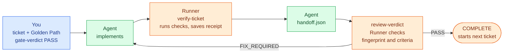

<!--
document_title: Coding Audit Harness
chinese_title: AI 寫的程式，驗過才算數
aka: []
established_date: 2026-09-29
updated_date: 2026-10-01
version: 3.1.0
-->

<div align="center">

# Coding Audit Harness

**AI-written code only counts once it's verified**

[](LICENSE)
[](#installation)

[繁體中文](README.md) · [简体中文](README.zh-CN.md) · English · [Français](README.fr.md) · [Latina](README.la.md)

[How it works](#how-a-ticket-goes-from-start-to-finish) · [Installation](#installation) · [Quick start](#quick-start) · [Command reference](#command-reference) · [Trust boundaries](#trust-boundaries)

</div>

<br>

You hand a requirement to a coding agent. Half an hour later it replies: "Done. All tests pass."

The problem is that you have no way to confirm that.

Not because you distrust the agent, but because all it gave you is a sentence. Nothing ties that sentence to any particular version of the code. After reporting, the agent edited `login.py` three more times and never re-ran the tests. The tests it wrote only cover the cases it could think of. It says "pass", yet no tool recorded that a pass happened, or which version of the code it happened on.

This is the classic failure mode of AI coding. **The problem isn't that the code can't be written. It's that nobody can verify it once it is.**

Coding Audit Harness exists for one reason: **to turn "it passed" from a claim into evidence you can trace.**

("Harness" here means the layer wrapped around the development process to constrain it, not a test harness.)

It cannot tell you whether your architecture is good or your tests are well written. It does two things: it blocks any "pass" that has no evidence behind it, and it blocks acceptance checks that don't map to any user requirement.

---

## The five parts of the system

| Part | Think of it as | What it actually is |
|---|---|---|
| **Audit skills** | Rulebook | Five Markdown files written for a coding agent to read (`skills/*-audit/SKILL.md`), one per development stage. Each lists the conditions that stage's output must meet. |
| **Runner** | Referee | A CLI program (`harness/runner/runner.py`). It takes no part in development and does one thing: check whether a PASS has matching evidence. If not, it exits non-zero. |
| **state.json** | Process log | A JSON file in your project recording the current stage, each ticket's status and any unresolved findings. It is the single source of truth; every decision is read from it. |
| **Verification evidence**<br>`evidence` | Receipt | Each time an acceptance command runs, the Runner saves a receipt: which command ran, its exit code, and the fingerprint of the code at that moment. |
| **Gate** | Checkpoint | A checkpoint that **you (a human)** must pass. The agent has no way to pass it by itself. |

### Why you can't just trust the agent's "tests pass"

The division of labor looks like this:

- **The agent writes the code, writes the tests and reports the result.** All three roles are the same model. Tests written by the same model only cover what that model thought of. It can't see what it missed, so nobody knows what was missed.
- **The Runner ignores the agent's report and trusts only receipts.** It re-runs the acceptance commands itself, computes the code fingerprint itself and compares them itself. To the Runner, "tests pass" from the agent means nothing.
- **A human presses the Gate.** Only you run that command. It means "I've looked at this and I approve", not "the system detected that everything is fine".

None of the three can stand in for another: the agent proposes, the Runner enforces, the operator approves. Remove any one and the process stops.

### It runs on top of Matt Pocock's five skills

The harness does not produce specs or code itself. That comes from [Matt Pocock's five skills](https://github.com/mattpocock/skills); the harness checks the output after each step. Each `*-audit` skill is the entry point: it first calls the matching Matt skill, waits for it to finish, then checks the output against its own rules. If the upstream skill is missing, it fails outright instead of skipping.

| Stage | Entry point (audit skill) | Matt skill it calls | Output | Runner enforcement |
|---|---|---|---|---|
| DISCOVERY | `grill-me-audit` | `grill-me` | `PLAN.md` | None |
| SPEC | `to-spec-audit` | `to-spec` | `SPEC.md` (with `US-NNN` User Stories) | None |
| TICKETS | `to-tickets-audit` | `to-tickets` | Tickets, `golden_path.json` | Gate: dependency graph, acceptance for each ticket, acceptance for each User Story |
| IMPLEMENTATION | `implement-audit` | `implement` (uses `tdd`) | Code, verification receipts | `verify-ticket` runs the checks itself and saves receipts |
| REVIEW | `code-review-audit` | `code-review` | Review result | Fingerprint, criteria and blocking-finding checks |

Matt's skills, together with `grilling` and `tdd` which they call, are pinned under `skills/matt-upstream/` without modification.

> [!NOTE]
> Audit skills are rules for the agent to read, and the agent that runs the audit is the same one that just ran the Matt skill. In the last three stages the Runner checks from the outside using receipts and fingerprints; in DISCOVERY and SPEC the agent only checks itself. Those two stages are exactly where "what do we actually want" gets settled, so for now, whether the result is what you wanted depends mostly on you reviewing `SPEC.md` and `golden_path.json` at the TICKETS Gate. What the Runner can guarantee there is structure only: every acceptance check points to a User Story, and every User Story has an acceptance check. Whether an assertion really verifies that requirement is still your call.

---

## How a ticket goes from start to finish



Say your requirement is "`add(2, 3)` must return 5". Here is what actually happens:

**1. You write the requirement as a ticket**
`.harness/tickets/T-001.md`. A ticket does one verifiable thing and declares its dependencies (`depends_on`), which decide the execution order.

**2. You define how it will be verified**
In `.harness/golden_path.json` you define how to prove the work is actually correct. Here that's one command, `python check_calc.py`, and `check_calc.py` contains `assert add(2, 3) == 5`. **The command must exit non-zero when it fails.** Printing `OK` is not verification.

**3. You pass the Gate: `gate-verdict --verdict PASS`**
The Runner now does four things: checks the dependencies have no cycles, **checks every ticket has at least one acceptance command it can run on its own**, **checks every acceptance check maps to a User Story in `SPEC.md` and every User Story has one**, and records a fingerprint of the current plan.

**4. The agent implements, then runs `verify-ticket`**
The Runner runs the acceptance command **itself** and saves the result as a receipt, stamped with the fingerprint of the code at that moment.

**5. The agent hands off**
It fills in `.harness/inbox/handoff.json`, copying four fields from the receipt verbatim.

**6. Review is submitted: `review-verdict --verdict PASS`**
The review result copies the same four fields. The Runner then runs its final checks:

- Does the receipt's code fingerprint **still match the current code?** (Did anyone touch the code after step 4?)
- Does every acceptance step on the receipt have a matching "pass" criterion in the review?
- Are there unresolved blocking findings?

**7. The ticket completes**
The Runner marks the ticket COMPLETE and automatically starts the next ticket whose dependencies are met.

**8. The last ticket**
The Runner additionally re-runs every acceptance command from scratch. If any one fails, the project is not marked complete.

---

## What the system includes

- A five-stage pipeline: `DISCOVERY → SPEC → TICKETS → IMPLEMENTATION → REVIEW → COMPLETE`
- 25 Runner command options (3 of them explicitly refused to prevent bypassing verification), with `state.json` as the single source of truth
- 5 audit skills defining decidable acceptance conditions for each stage
- Golden Path verification: every ticket needs its own command that yields PASS/FAIL independently, and every command must point to a User Story in `SPEC.md`
- Evidence binding: `source_hash` (code fingerprint) + `verification_id` (unique ID of one verification run) + `review_round` (which review round) are bound together, so a PASS cannot be reused on a different code state

### What it is not

- **Not a sandbox.** The same OS user can edit the state, the tests and the evidence. Hashes are freshness checks, not digital signatures. The tool guards against mistakes, not against an attacker with the same privileges.
- **No agent runtime.** It doesn't call an LLM, connect to MCP, or have a web UI or scheduler. Skills are rule files for a coding agent to read, not an execution engine.
- **No quality judgment.** It doesn't assess your architecture or how well your tests are written. Those judgments belong to the review criteria and the Gate.
- **No multi-user collaboration.** One state, one writer (locked). Concurrent handoffs are not implemented.

### Three layers of responsibility

| Layer | Location | Who acts | Responsible for |
|---|---|---|---|
| **Audit skills** | `skills/*-audit/SKILL.md` | Agent (reads the rules) | Defining what each stage's output must satisfy; rejecting invalid output |
| **Runner** | `harness/runner/` | CLI (enforces) | Checking evidence exists, hashes match and the process wasn't bypassed; exits non-zero otherwise |
| **Operator (you)** | — | Human | `gate-verdict` / `decide` are **human approvals**. The tool never declares PASS by itself |

> [!IMPORTANT]
> **The Runner takes over at TICKETS.** `init` sets the stage straight to `TICKETS` (see `initialize()` in `harness/runner/workflow.py`), so **no CLI path reaches** `DISCOVERY` or `SPEC`. The acceptance conditions of `grill-me-audit` and `to-spec-audit` are currently followed by the agent on its own; the Runner does not enforce them at the stage level. The one exception is that the TICKETS Gate reads the User Stories list in `SPEC.md` and checks how it maps to the Golden Path. Runner enforcement for those two stages is not implemented; see [Deferred Items](docs/DEFERRED_ITEMS.md) (Traditional Chinese).

---

## Installation

Requires Python 3.12 (the version CI uses). The only third-party dependency is `jsonschema>=4.18,<5` (`referencing` comes with it).

```powershell
python -m pip install -r requirements.txt
```

### Repository layout

```text
Coding-Audit-Harness/
├── harness/              # CLI Runner, JSON Schemas, test suite
│   ├── runner/           # 12 implementation modules + 8 test modules + shared fixture helper
│   ├── *.schema.json    # 7 schemas (state / gate-result / review-result / handoff / finding / decision / change-impact)
│   └── state.schema.json
├── skills/
│   ├── *-audit/          # 5 audit wrappers (original to this project)
│   └── matt-upstream/    # Matt Pocock's upstream skills (vendored, unmodified)
├── docs/                 # CHANGELOG / Deferred Items / Symbol-first Context
└── .github/workflows/    # Windows + Ubuntu CI
```

Runtime data (`state.json`, tickets, receipts) lives in the **target project**, not in this repository:

```text
<target-project>/.harness/
├── state.json                    # single source of truth
├── golden_path.json              # part of the approved plan
├── tickets/T-NNN.md              # tickets
├── inbox/                        # handoff.json / review.json you write
├── verifications/                # receipts generated by the Runner
├── reviews/                      # review history generated by the Runner
├── decisions/DEC-NNN.json        # decision records
└── traceability/traceability.json
```

---

## Quick start

A minimal example that actually runs end to end. Assume the target project is `C:\work\calc`.

### 0. Put the harness in the target project

```powershell
Copy-Item -Recurse <this-repo>\harness C:\work\calc\harness
cd C:\work\calc
python -m pip install -r requirements.txt
```

**`harness/` must be inside the target project**: the Runner reads `harness/*.schema.json` relative to `--project-root`. If the target project already has a `.harness/`, **back it up first and do not reset existing state**.

### 1. Write the User Stories in SPEC.md

`SPEC.md` (project root):

```markdown
# Spec

## User Stories

1. US-001: As a user, I want to add two numbers, so that I get their sum
```

The TICKETS Gate only reads list items that start with `US-NNN` inside a section whose heading contains "User Stories" (`1. US-001: ...`, `- US-001: ...` and `- **US-001**: ...` all work). The Gate refuses if `SPEC.md` is missing, the section has no `US-NNN` at all, or an ID is duplicated. In the normal flow this file is produced by `to-spec-audit`.

### 2. Create a ticket

`.harness/tickets/T-001.md`:

```markdown
---
id: T-001
depends_on: []
---

# T-001: Implement addition

- [ ] `add(2, 3)` returns 5
```

`depends_on` accepts `[T-001, T-002]` or `[]`. If omitted, the ticket has no dependencies. Multiline YAML, quoted values, scalars, duplicate fields and malformed syntax are **all rejected**.

### 3. Create the Golden Path

`.harness/golden_path.json`:

```json
{
  "steps": [{
    "id": "GP-001",
    "description": "Addition is correct",
    "user_story_ids": ["US-001"],
    "ticket_ids": ["T-001"],
    "verification_command": ["python", "check_calc.py"],
    "expected_output": ""
  }]
}
```

`check_calc.py`:

```python
from calc import add
assert add(2, 3) == 5
```

Every step is a required check. Commands must contain real assertions and exit non-zero on failure; a fixed `print` is not enough to verify a feature.

**Every ticket needs at least one step whose `ticket_ids` contain only that ticket plus its prerequisites** (direct or indirect `depends_on`). You can add end-to-end steps spanning several tickets, but they only run once all listed tickets are COMPLETE, so **they can never be a ticket's only verification**. On TICKETS Gate PASS, a missing step, a step with no command, or a step referencing an unknown ticket is refused.

**Each step's `user_story_ids` must not be empty and may only reference IDs defined in `SPEC.md`; every User Story must be referenced by at least one step that has a command.** This rule means every acceptance check can say which requirement it proves. A step may list several User Stories, but its assertions must actually verify each of them; a step that only proves the code runs verifies no requirement at all.

### 4. Optional settings

Set at the top level of `golden_path.json`; they are part of the approved plan:

- **`source_hash_exclude`**: files generated by the acceptance commands (relative glob paths), e.g. `[".coverage", "htmlcov", "dist", "*.log"]`. Without it, any command that writes a file makes `verify-ticket` refuse with `Project changed during verification`. **It cannot cover `.harness`, `*` or the whole project; excluding source files means their changes go undetected.**
- **`env_passthrough`**: names of extra environment variables the commands need.

### 5. Initialize and pass the TICKETS Gate

```powershell
python harness/runner/runner.py init
python harness/runner/runner.py set-ready-for-gate
python harness/runner/runner.py gate-verdict --verdict PASS
```

`init` creates a state with every ticket TODO and **refuses to overwrite an existing state**. On TICKETS Gate PASS the Runner: validates the dependency graph and ticket set, checks acceptance coverage for every ticket and every User Story, records the fingerprint of the approved plan (ticket files + `golden_path.json` + `SPEC.md`), and starts the first runnable ticket.

Prerequisite tickets don't all need to be finished before work starts.

### 6. Implement → verify → review

```powershell
python harness/runner/runner.py verify-ticket --ticket T-001 --trust-commands
python harness/runner/runner.py mark-ticket-ready-for-review --ticket T-001
```

`verify-ticket` output:

```json
{
  "ticket_id": "T-001",
  "review_round": 1,
  "source_hash": "<64-character SHA-256>",
  "verification_id": "<uuid4 hex>",
  "all_passed": true,
  "results": [{"step_id": "GP-001", "status": "PASSED", "returncode": 0, "stdout": "", "stderr": ""}]
}
```

**Copy the four binding fields verbatim into both payloads.** Any later code change invalidates them, and you must re-run `verify-ticket`.

`.harness/inbox/handoff.json`:

```json
{
  "ticket_id": "T-001",
  "review_round": 1,
  "source_hash": "<from verify-ticket>",
  "verification_id": "<from verify-ticket>",
  "changes": [{"file": "calc.py", "summary": "Implement addition"}],
  "verification": [{"step": "python check_calc.py", "expected": "exit 0", "actual": "exit 0", "status": "PASS"}],
  "dependencies": []
}
```

`.harness/inbox/review.json`:

```json
{
  "ticket_id": "T-001",
  "review_round": 1,
  "source_hash": "<same as above>",
  "verification_id": "<same as above>",
  "verdict": "PASS",
  "criteria": [{"id": "GP-001", "status": "PASS", "critical": true}],
  "findings": []
}
```

**Every enabled GP step must have one criterion with `critical: true` and `PASS`.** Additional manual required criteria need `status: "PASS"`, `source` (who observed it, and where) and `limitations` (what it doesn't cover); the Runner rejects them if any of the three is missing.

Manual text **cannot replace** the controlled execution evidence of a GP step. It is an explicitly labeled operator statement, not evidence of the same kind.

```powershell
python harness/runner/runner.py review-verdict --ticket T-001 --verdict PASS `
  --review .harness/inbox/review.json --handoff .harness/inbox/handoff.json --trust-commands
python harness/runner/runner.py validate
python harness/runner/status.py --json
```

When a ticket other than the last one completes, the same state automatically starts the next TODO ticket whose dependencies are complete.

---

## Pipeline details

### Gates in the planning stages

`DISCOVERY`, `SPEC` and `TICKETS` each support three outcomes:

| Outcome | Effect |
|---|---|
| `PASS` | Advance to the next stage |
| `FIX_REQUIRED` | Stay in the stage; stage_status returns to `IN_PROGRESS` |
| `USER_DECISION_REQUIRED` | Project pauses; requires `--decision-ref DEC-NNN` |

(In practice the CLI only ever stops at `TICKETS`; see the three-layer section above for why.)

### The last ticket

Before submitting, the Runner **re-runs every Golden Path step itself** (Final Integrated Verification). Any step FAIL / UNVERIFIED, a failed artifact write or a state conflict prevents COMPLETE.

The reviewer must also add one manual criterion:

```json
{"id": "FINAL_INTEGRATION", "status": "PASS", "critical": true,
 "source": "Ran the full test suite and checked behavior against US-001", "limitations": "Windows CI environment not covered"}
```

### Explicitly refused legacy commands

`complete-ticket`, `ready-for-review` and `increment-review` fail immediately with a non-zero exit, because they could bypass verification and review evidence. Use `mark-ticket-ready-for-review` + `review-verdict --review --handoff` instead.

`payload_validator.py` still checks the legacy payload structure, but **passing it does not satisfy the Workflow's completion conditions**: the Workflow separately checks the binding fields, receipt contents and finding status.

### Changes to the approved plan

If anything in the approved plan changes after approval (`golden_path.json`, ticket files, `SPEC.md`), for example a relaxed acceptance command or a trimmed ticket, the next `verify-ticket` or `review-verdict` pauses automatically with reason `PLAN_CHANGE_REQUIRES_DECISION` and **produces no new evidence**.

```powershell
python harness/runner/runner.py decide --option CONTINUE --rationale '...' --source '...'
python harness/runner/runner.py resume
```

`resume` re-checks the dependency graph and acceptance coverage (including the User Story mapping) and updates the approved fingerprint. New tickets join as TODO; **removing approved tickets is not supported**.

If the plan changes again after the decision, resume opens a new decision. Reverting to the original also requires a decision. This kind of pause **cannot be created manually with `pause`**.

---

## Failures and fixes

### A verification fails

The failed receipt is still saved and the CLI exits non-zero. **Fix the code and run it again; old results are never reused.** Changes to the project during verification are also refused.

### A review fails

Use `FIX_REQUIRED` with at least one blocking finding:

```json
{"finding_key": "wrong-addition", "criterion_ref": "GP-001",
 "description": "Adding negative numbers gives the wrong result", "blocking": true}
```

`finding_key` is **a slug that identifies the same problem across review rounds**. When the same problem comes back, **reuse the same key**.

`FIX_REQUIRED` doesn't need a successful handoff or receipt, but it still needs the correct `ticket_id`, the next `review_round` and the `source_hash` (get it with `snapshot`):

```powershell
python harness/runner/runner.py snapshot
python harness/runner/runner.py review-verdict --ticket T-001 --verdict FIX_REQUIRED --review .harness/inbox/review.json
python harness/runner/runner.py update-fix-memory --ticket T-001 --finding-data 'Fix negative addition'
python harness/runner/runner.py resolve-finding --finding-id F-001
```

**Only resolve once the fix is confirmed.** If the same `finding_key` appears again it becomes `REOPENED` and still blocks completion. While any blocking finding is OPEN or REOPENED, the Runner refuses PASS.

### After three attempts, it pauses

The default `retry_limit` is 3. When reached, the project pauses automatically and a new `.harness/decisions/DEC-NNN.json` is created; **history is never overwritten**.

| Pause reason | Only supported option |
|---|---|
| `RETRY_LIMIT_REACHED` | `CONTINUE` |
| `PLAN_CHANGE_REQUIRES_DECISION` | `CONTINUE` |
| `GATE_USER_DECISION_REQUIRED` | `FIX_REQUIRED` |
| `REVIEW_USER_DECISION_REQUIRED` | `FIX_REQUIRED` |

Unimplemented options such as PASS override, ABORT or INVALIDATE are not offered. `decision_context.options` may only list supported options.

```powershell
python harness/runner/runner.py decide --option CONTINUE --rationale 'Root cause found; approve three more fix rounds' --source 'local operator'
python harness/runner/runner.py resume
```

A blank rationale, `resolved: false`, a stale `pause_id`, the wrong ticket or stage, or an invalid option are all rejected.

`CONTINUE` grants three more attempts. `review_attempts` keeps the cumulative FIX_REQUIRED count, `review_total` counts every review, and `review_history` is **never cleared**. After resuming, fix, verify, mark ready for review and review again.

### Manual pause

```powershell
python harness/runner/runner.py pause --reason REVIEW_USER_DECISION_REQUIRED --decision-ref DEC-999
```

A pause from an older version without a `pause_id` **does not automatically accept past decisions**. Back up first and rebuild the process in an isolated copy; **don't edit the real state to get around verification**. The tool does not migrate old runtime data automatically.

---

## Command reference

### `runner.py` (main entry point)

| Command | Purpose |
|---|---|
| `init` | Create the initial state (refuses to overwrite) |
| `read` / `validate` | Read / validate the state |
| `set-ready-for-gate` | Mark the current stage ready for the Gate |
| `gate-verdict --verdict` | Record the Gate result (**operator action**) |
| `verify-ticket --ticket --trust-commands` | Run the Golden Path and produce a receipt |
| `mark-ticket-ready-for-review --ticket` | Mark a ticket ready for review |
| `review-verdict --ticket --verdict --review --handoff` | Submit a review result |
| `snapshot` | Print the current `source_hash` |
| `add-finding` / `resolve-finding` | Manage findings manually |
| `fix-loop-memory` / `update-fix-memory` | View / update the fix log |
| `pause` / `resume` / `decide` / `recover` | Process control and recovery |
| `executable-tickets` / `next-ticket` / `blocked-tickets` / `validate-deps` | Dependency queries |
| `start-ticket` | Start a ticket manually (dependencies are checked) |

Global options: `--project-root` (defaults to the current directory), `--trust-commands`, `--timeout` (default 60 seconds, valid range `0 < t <= 3600`), `--ticket`, `--verdict`, `--review`, `--handoff`, `--reason`, `--decision-ref`, `--finding-id`, `--finding-data`, `--option`, `--rationale`, `--source`.

Without `--trust-commands`, `verify-ticket` and `review-verdict` refuse to run any project command and raise `PermissionError`. This is intentional, not a bug.

### Helper CLIs

| Script | Commands |
|---|---|
| `status.py` | `--json` (machine-readable), `--project-root` |
| `traceability.py` | `create-scope` / `create-story` / `create-ticket` / `get` / `trace` / `validate` / `report` / `list` |
| `dependency_scheduler.py` | `validate` / `executable` / `next` / `blocked` / `can-start --ticket` |
| `payload_validator.py` | `<gate\|review\|finding\|handoff\|change-impact> --file [--strict]` |
| `run_tests.py` | `--output <path>` / `--legacy-only` |

`traceability.py` stores its data in `.harness/traceability/traceability.json` and records the mapping `SCOPE → USER_STORY → TICKET`. `status.py` shows traceability coverage, but **it is not a completion condition**: having no traceability entities does not block a ticket from completing.

---

## Trust boundaries

> [!WARNING]
> **Local JSON is not a tamper-proof security system.** The same user can change the code, state, tests and evidence. The tool prevents mistakes, stale evidence and process bypasses through the normal CLI; it does not resist a malicious user with the same privileges, and it does not judge the quality of tests or human reviews.

### `--trust-commands`

> [!CAUTION]
> Explicitly authorizes this run to execute project commands, with **the current user's privileges**. **The working directory is not a sandbox**: commands can still reach any file and network the user can. Nothing runs without this authorization. Put untrusted repositories in a genuinely isolated OS or VM first; this tool provides no such isolation.

### Environment variable filtering

By default only PATH, system and toolchain paths (`SYSTEMROOT`, `USERPROFILE`, `APPDATA`, `LOCALAPPDATA`, `HOME`, `PROGRAMFILES`, etc.), temp paths and locale are passed, and Python is pinned to UTF-8 with bytecode writing disabled. **Tokens and other inherited variables are not passed.** List any other variable a tool genuinely needs, by name, in `env_passthrough` in `golden_path.json`.

Path variables are not credentials: commands can already read the user's files, because this is not a sandbox.

### Child process cleanup

On Windows a Job Object is used: the process is spawned suspended, assigned to the job and then resumed. On timeout, error or normal exit the job is closed, terminating all descendants. On POSIX a process group is used; **processes that deliberately leave the group are not covered.**

stdout/stderr are kept in memory and in artifacts. **Only run commands with reasonable output volume and no secrets in their output**: there is currently no hard limit.

---

## Integrity mechanisms

### Content hashing

SHA-256 works for projects with or without Git. It **does not initialize Git**, and it does not treat a commit as a stand-in for uncommitted changes. It covers ordinary project files, tickets and `golden_path.json`, and by default excludes `.git`, `__pycache__`, `.pytest_cache`, `.mypy_cache`, `.ruff_cache`, `.venv`, `venv`, `node_modules` and other `.harness` runtime data, plus anything listed in `source_hash_exclude`.

**Never exclude business code or tests that are under verification.** Use it only on trusted projects without secrets: hashing reads file contents, although the evidence stores only digests. External tool/dependency versions and service state are **not part of the hash**; pin your environment or re-verify.

### Incremental strategy

Every run re-executes **all** enabled steps with no caching. The current ticket and completed tickets both count as enabled. After code or ticket changes, old receipts are refused; content changes during verification are refused too.

### State writes

An OS file lock plus a SHA-256 compare-and-swap on the bytes read; a stale writer always exits non-zero. The lock is released when the process exits, and `writer.lock` stays in place; **don't delete an active lock file**. On conflict, re-read / recover, confirm the state, then redo the operation.

Artifacts are **written first, and the state is atomically replaced last**. A failure may leave an orphaned artifact the state doesn't reference; **that does not mean anything completed**. Recovery only uses artifacts the state references. A corrupted state is reported, never guessed at or repaired; restore it from a verified backup.

There are no guarantees of durability across a whole-machine power loss or against malicious concurrent file edits.

---

## Running the tests

```powershell
$env:PYTHONUTF8 = '1'
$env:PYTHONDONTWRITEBYTECODE = '1'
python harness/runner/run_tests.py
```

Each test case builds its own temporary project, with the CLI, schemas, tickets and state all pointing at the same fixture. By default JSON, logs and CLI/state snapshots are written to `test-results/results.json` and `test-results/results.log` (ignored by Git), and **the code hash and existing `.harness/` data hash are compared before and after the run**: if a test touches anything it shouldn't, the run fails.

`--legacy-only` skips the `test_reliability` and `test_review_fixes` groups and runs only the original six modules. CI uses the same entry point; GitHub Actions is the authority for remote results.

---

## Related documents

- [CHANGELOG](docs/CHANGELOG.md): reliability fixes and repository cleanup history (Traditional Chinese)
- [Symbol-first Context](docs/SYMBOL_FIRST_CONTEXT.md): read symbols before implementations when expanding code context
- [Deferred Items](docs/DEFERRED_ITEMS.md): what is explicitly **not implemented**, with reconsideration triggers (Traditional Chinese)

---

## License

The original parts of this project are released under the [MIT License](LICENSE).

Copyright (c) 2026 Liang Wei Dai (Alvin)

`skills/matt-upstream/` contains Matt Pocock's upstream work (pinned commit `c55ee46`, retrieved 2026-09-24, **no local modifications**). See the [upstream LICENSE](skills/matt-upstream/LICENSE) for its copyright and MIT notice, and [UPSTREAM.md](skills/matt-upstream/UPSTREAM.md) for source and version.
