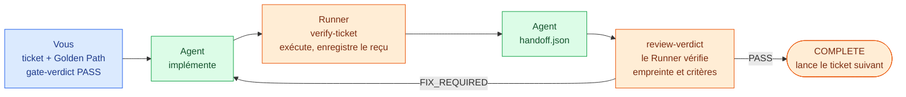

<!--
document_title: Coding Audit Harness
chinese_title: AI 寫的程式，驗過才算數
aka: []
established_date: 2026-09-29
updated_date: 2026-10-01
version: 3.1.0
-->

<div align="center">

# Coding Audit Harness

**Le code écrit par l'IA ne compte qu'une fois vérifié**

[](LICENSE)
[](#installation)

[繁體中文](README.md) · [简体中文](README.zh-CN.md) · [English](README.en.md) · Français

[Fonctionnement](#parcours-complet-dun-ticket) · [Installation](#installation) · [Démarrage rapide](#démarrage-rapide) · [Référence des commandes](#référence-des-commandes) · [Limites de confiance](#limites-de-confiance)

</div>

<br>

Vous confiez un besoin à un agent de code. Une demi-heure plus tard, il répond : « C'est fait, tous les tests passent. »

Le problème, c'est que vous n'avez aucun moyen de le vérifier.

Ce n'est pas une question de confiance envers l'agent : il vous a simplement donné une phrase. Rien ne rattache cette phrase à une version précise du code. Après son rapport, l'agent a encore modifié `login.py` trois fois sans relancer les tests. Les tests qu'il a écrits ne couvrent que les cas auxquels il a pensé. Il affirme que « ça passe », mais aucun outil n'a enregistré que ce passage a eu lieu, ni sur quelle version du code.

C'est l'échec typique du développement assisté par IA. **Le problème n'est pas d'écrire le code, c'est que personne ne peut le vérifier une fois écrit.**

Coding Audit Harness n'existe que pour une raison : **transformer « ça a passé » d'une simple affirmation en une preuve traçable.**

(Ici, « harness » désigne la couche qui enveloppe le processus de développement pour l'encadrer, et non un harnais de test.)

Il ne sait pas juger si votre architecture est bonne ni si vos tests sont bien écrits. Il fait deux choses : il bloque tout « ça passe » qui n'est pas appuyé par une preuve, et il bloque les critères d'acceptation qui ne correspondent à aucun besoin utilisateur.

---

## Les cinq éléments du système

| Élément | Image | Ce que c'est concrètement |
|---|---|---|
| **Audit skills** | Règlement | Cinq fichiers Markdown destinés à l'agent de code (`skills/*-audit/SKILL.md`), un par étape de développement. Chacun liste les conditions que la production de l'étape doit remplir. |
| **Runner** | Arbitre | Un programme en ligne de commande (`harness/runner/runner.py`). Il ne participe pas au développement et ne fait qu'une chose : vérifier qu'un PASS est accompagné d'une preuve. Sinon, il sort avec un code non nul. |
| **state.json** | Journal du processus | Un fichier JSON du projet qui enregistre l'étape en cours, le statut de chaque ticket et les problèmes non résolus. C'est l'unique source de vérité ; toutes les décisions s'appuient sur lui. |
| **Preuve de vérification**<br>`evidence` | Reçu | À chaque exécution d'une commande d'acceptation, le Runner enregistre un reçu : la commande lancée, son code de sortie et l'empreinte du code à ce moment-là. |
| **Gate** | Point de contrôle | Un point de contrôle que **vous (un humain)** devez valider. L'agent ne peut pas le franchir seul. |

### Pourquoi ne pas se contenter du « les tests passent » de l'agent

La répartition des rôles est la suivante :

- **L'agent écrit le code, écrit les tests et rapporte le résultat.** Les trois rôles sont tenus par le même modèle. Des tests écrits par ce modèle ne couvrent que ce à quoi il a pensé. Il ne voit pas ce qu'il a oublié, donc personne ne le sait.
- **Le Runner ignore le rapport de l'agent et ne croit que les reçus.** Il relance lui-même les commandes d'acceptation, calcule lui-même l'empreinte du code et compare lui-même. Pour lui, le « les tests passent » de l'agent ne vaut rien.
- **La Gate est validée par un humain.** Vous seul lancez cette commande. Elle signifie « j'ai regardé et j'approuve », et non « le système a détecté que tout va bien ».

Aucun des trois ne peut remplacer les autres : l'agent propose, le Runner impose, l'opérateur approuve. Qu'un seul manque, et le processus s'arrête.

### Il s'appuie sur les cinq skills de Matt Pocock

Le harness ne produit lui-même ni spécification ni code. Cela revient aux [cinq skills de Matt Pocock](https://github.com/mattpocock/skills) ; le harness contrôle la production après chaque étape. Chaque skill `*-audit` sert de point d'entrée : il appelle d'abord le skill de Matt correspondant, attend la fin de son exécution, puis contrôle le résultat avec ses propres règles. Si le skill amont est absent, il échoue directement au lieu de passer outre.

| Étape | Point d'entrée (skill d'audit) | Skill de Matt appelé | Production | Contrôle par le Runner |
|---|---|---|---|---|
| DISCOVERY | `grill-me-audit` | `grill-me` | `PLAN.md` | Aucun |
| SPEC | `to-spec-audit` | `to-spec` | `SPEC.md` (avec des User Stories `US-NNN`) | Aucun |
| TICKETS | `to-tickets-audit` | `to-tickets` | Tickets, `golden_path.json` | Gate : graphe de dépendances, acceptation de chaque ticket, acceptation de chaque User Story |
| IMPLEMENTATION | `implement-audit` | `implement` (utilise `tdd`) | Code, reçus de vérification | `verify-ticket` exécute lui-même les contrôles et enregistre les reçus |
| REVIEW | `code-review-audit` | `code-review` | Résultat de la revue | Vérification de l'empreinte, des critères et des problèmes bloquants |

Les skills de Matt, ainsi que `grilling` et `tdd` qu'ils appellent, sont figés dans `skills/matt-upstream/` sans modification.

> [!NOTE]
> Les skills d'audit sont des règles que l'agent lit, et c'est l'agent qui vient d'exécuter le skill de Matt qui mène l'audit. Dans les trois dernières étapes, le Runner contrôle de l'extérieur à l'aide des reçus et des empreintes ; en DISCOVERY et en SPEC, l'agent ne contrôle que lui-même. Or ce sont précisément ces deux étapes qui fixent « ce que l'on veut vraiment ». Pour l'instant, savoir si le résultat correspond à ce que vous vouliez dépend donc surtout de votre relecture de `SPEC.md` et de `golden_path.json` à la Gate TICKETS. Le Runner ne peut y garantir que la structure : chaque critère d'acceptation renvoie à une User Story, et chaque User Story a un critère d'acceptation. Savoir si une assertion vérifie réellement ce besoin reste votre décision.

---

## Parcours complet d'un ticket



Supposons que votre besoin soit « `add(2, 3)` doit renvoyer 5 ». Voici ce qui se passe réellement :

**1. Vous rédigez le besoin sous forme de ticket**
`.harness/tickets/T-001.md`. Un ticket ne fait qu'une chose vérifiable et déclare ses dépendances (`depends_on`), qui fixent l'ordre d'exécution.

**2. Vous définissez la façon de vérifier**
Dans `.harness/golden_path.json`, vous définissez comment prouver que le travail est réellement correct. Ici, il s'agit d'une commande, `python check_calc.py`, et `check_calc.py` contient `assert add(2, 3) == 5`. **La commande doit sortir avec un code non nul en cas d'échec.** Afficher `OK` ne constitue pas une vérification.

**3. Vous validez la Gate : `gate-verdict --verdict PASS`**
Le Runner fait alors quatre choses : il vérifie que les dépendances ne forment pas de cycle, **que chaque ticket dispose d'au moins une commande d'acceptation exécutable de façon autonome**, **que chaque critère d'acceptation correspond à une User Story de `SPEC.md` et que chaque User Story en a un**, puis il enregistre l'empreinte du plan courant.

**4. L'agent implémente, puis lance `verify-ticket`**
Le Runner exécute **lui-même** la commande d'acceptation et enregistre le résultat dans un reçu, marqué de l'empreinte du code à ce moment-là.

**5. L'agent passe la main**
Il remplit `.harness/inbox/handoff.json` en recopiant tels quels quatre champs du reçu.

**6. La revue est soumise : `review-verdict --verdict PASS`**
Le résultat de la revue recopie les mêmes quatre champs. Le Runner effectue alors ses derniers contrôles :

- L'empreinte du code sur le reçu **correspond-elle toujours au code actuel ?** (Quelqu'un a-t-il modifié le code après l'étape 4 ?)
- Chaque étape d'acceptation du reçu a-t-elle un critère « réussi » correspondant dans la revue ?
- Reste-t-il des problèmes bloquants non résolus ?

**7. Le ticket est terminé**
Le Runner marque le ticket COMPLETE et lance automatiquement le ticket suivant dont les dépendances sont satisfaites.

**8. Le dernier ticket**
Le Runner relance en plus toutes les commandes d'acceptation depuis le début. Si une seule échoue, le projet n'est pas marqué comme terminé.

---

## Contenu du système

- Un pipeline en cinq étapes : `DISCOVERY → SPEC → TICKETS → IMPLEMENTATION → REVIEW → COMPLETE`
- 25 options de commande du Runner (dont 3 explicitement refusées pour empêcher de contourner la vérification), avec `state.json` comme unique source de vérité
- 5 audit skills qui définissent, pour chaque étape, des conditions d'acceptation décidables
- Vérification par Golden Path : chaque ticket a besoin de sa propre commande donnant PASS/FAIL de façon autonome, et chaque commande doit renvoyer à une User Story de `SPEC.md`
- Liaison des preuves : `source_hash` (empreinte du code) + `verification_id` (identifiant unique d'une exécution de vérification) + `review_round` (numéro du tour de revue) sont liés, de sorte qu'un PASS ne peut pas être réutilisé sur un autre état du code

### Ce qu'il n'est pas

- **Pas un bac à sable.** Le même utilisateur du système peut modifier l'état, les tests et les preuves. Les hachages servent à vérifier la fraîcheur, ce ne sont pas des signatures numériques. L'outil protège contre les erreurs de manipulation, pas contre un attaquant disposant des mêmes droits.
- **Pas de runtime d'agent.** Il n'appelle aucun LLM, ne se connecte pas à MCP et n'a ni interface web ni planificateur. Les skills sont des fichiers de règles lus par l'agent, pas un moteur d'exécution.
- **Pas de jugement de qualité.** Il n'évalue ni votre architecture ni la qualité de vos tests. Ces jugements relèvent des critères de revue et de la Gate.
- **Pas de collaboration multi-utilisateur.** Un seul état, un seul écrivain (verrouillé). Les handoffs concurrents ne sont pas implémentés.

### Trois niveaux de responsabilité

| Niveau | Emplacement | Qui agit | Responsable de |
|---|---|---|---|
| **Audit skills** | `skills/*-audit/SKILL.md` | Agent (lit les règles) | Définir ce que doit satisfaire la production de chaque étape ; rejeter une production invalide |
| **Runner** | `harness/runner/` | CLI (impose) | Vérifier que la preuve existe, que les hachages concordent et que le processus n'a pas été contourné ; sinon, sortie avec code non nul |
| **Opérateur (vous)** | — | Humain | `gate-verdict` / `decide` sont des **approbations humaines**. L'outil ne déclare jamais PASS de lui-même |

> [!IMPORTANT]
> **Le Runner prend le relais à l'étape TICKETS.** `init` place directement l'étape sur `TICKETS` (voir `initialize()` dans `harness/runner/workflow.py`), si bien qu'**aucun chemin CLI ne mène** à `DISCOVERY` ni à `SPEC`. Les conditions d'acceptation de `grill-me-audit` et de `to-spec-audit` ne sont pour l'instant respectées que par l'agent lui-même ; le Runner ne les impose pas au niveau de l'étape. Seule exception : la Gate TICKETS lit la liste des User Stories de `SPEC.md` et vérifie sa correspondance avec le Golden Path. Le contrôle de ces deux étapes par le Runner n'est pas implémenté ; voir [Deferred Items](docs/DEFERRED_ITEMS.md) (en chinois traditionnel).

---

## Installation

Nécessite Python 3.12 (la version utilisée par la CI). La seule dépendance tierce est `jsonschema>=4.18,<5` (`referencing` est installé avec elle).

```powershell
python -m pip install -r requirements.txt
```

### Arborescence du dépôt

```text
Coding-Audit-Harness/
├── harness/              # Runner CLI, schémas JSON, suite de tests
│   ├── runner/           # 12 modules d'implémentation + 8 modules de test + helper de fixture partagé
│   ├── *.schema.json    # 7 schémas (state / gate-result / review-result / handoff / finding / decision / change-impact)
│   └── state.schema.json
├── skills/
│   ├── *-audit/          # 5 wrappers d'audit (propres à ce projet)
│   └── matt-upstream/    # skills amont de Matt Pocock (vendored, non modifiés)
├── docs/                 # CHANGELOG / Deferred Items / Symbol-first Context
└── .github/workflows/    # CI Windows + Ubuntu
```

Les données d'exécution (`state.json`, tickets, reçus) sont créées dans le **projet cible**, pas dans ce dépôt :

```text
<target-project>/.harness/
├── state.json                    # unique source de vérité
├── golden_path.json              # fait partie du plan approuvé
├── tickets/T-NNN.md              # tickets
├── inbox/                        # handoff.json / review.json que vous rédigez
├── verifications/                # reçus générés par le Runner
├── reviews/                      # historique des revues généré par le Runner
├── decisions/DEC-NNN.json        # registre des décisions
└── traceability/traceability.json
```

---

## Démarrage rapide

Un exemple minimal qui fonctionne de bout en bout. Supposons que le projet cible soit `C:\work\calc`.

### 0. Placer le harness dans le projet cible

```powershell
Copy-Item -Recurse <this-repo>\harness C:\work\calc\harness
cd C:\work\calc
python -m pip install -r requirements.txt
```

**`harness/` doit se trouver dans le projet cible** : le Runner lit `harness/*.schema.json` relativement à `--project-root`. Si le projet cible contient déjà un `.harness/`, **sauvegardez-le d'abord et ne réinitialisez pas l'état existant**.

### 1. Écrire les User Stories dans SPEC.md

`SPEC.md` (à la racine du projet) :

```markdown
# Spec

## User Stories

1. US-001: As a user, I want to add two numbers, so that I get their sum
```

La Gate TICKETS ne lit que les éléments de liste commençant par `US-NNN` dans une section dont le titre contient « User Stories » (`1. US-001: ...`, `- US-001: ...` et `- **US-001**: ...` sont tous acceptés). Elle refuse si `SPEC.md` est absent, si la section ne contient aucun `US-NNN` ou si un identifiant est en double. Dans le flux normal, ce fichier est produit par `to-spec-audit`.

### 2. Créer un ticket

`.harness/tickets/T-001.md` :

```markdown
---
id: T-001
depends_on: []
---

# T-001: Implémenter l'addition

- [ ] `add(2, 3)` renvoie 5
```

`depends_on` accepte `[T-001, T-002]` ou `[]`. S'il est omis, le ticket n'a pas de dépendances. Le YAML multiligne, les valeurs entre guillemets, les scalaires, les champs en double et les erreurs de format sont **tous rejetés**.

### 3. Créer le Golden Path

`.harness/golden_path.json` :

```json
{
  "steps": [{
    "id": "GP-001",
    "description": "L'addition est correcte",
    "user_story_ids": ["US-001"],
    "ticket_ids": ["T-001"],
    "verification_command": ["python", "check_calc.py"],
    "expected_output": ""
  }]
}
```

`check_calc.py` :

```python
from calc import add
assert add(2, 3) == 5
```

Chaque step est une vérification obligatoire. Les commandes doivent contenir de vraies assertions et sortir avec un code non nul en cas d'échec ; un `print` figé ne suffit pas à valider une fonctionnalité.

**Chaque ticket a besoin d'au moins un step dont les `ticket_ids` ne contiennent que ce ticket et ses prérequis** (`depends_on` directs ou indirects). Vous pouvez ajouter des steps de bout en bout couvrant plusieurs tickets, mais ils ne s'exécutent qu'une fois tous les tickets listés à l'état COMPLETE : **ils ne peuvent donc jamais être la seule vérification d'un ticket**. Lors d'un PASS à la Gate TICKETS, un step manquant, un step sans commande ou un step qui référence un ticket inconnu est refusé.

**Les `user_story_ids` de chaque step ne peuvent pas être vides et ne peuvent référencer que des identifiants définis dans `SPEC.md` ; chaque User Story doit être référencée par au moins un step doté d'une commande.** Grâce à cette règle, chaque critère d'acceptation peut dire quel besoin il prouve. Un step peut lister plusieurs User Stories, mais ses assertions doivent réellement vérifier chacune d'elles ; un step qui prouve seulement que le code s'exécute ne vérifie aucun besoin.

### 4. Paramètres facultatifs

À placer au premier niveau de `golden_path.json` ; ils font partie du plan approuvé :

- **`source_hash_exclude`** : les fichiers générés par les commandes d'acceptation (motifs glob relatifs), par exemple `[".coverage", "htmlcov", "dist", "*.log"]`. Sans ce paramètre, toute commande qui écrit un fichier conduit `verify-ticket` à refuser avec `Project changed during verification`. **Il ne peut couvrir ni `.harness`, ni `*`, ni l'ensemble du projet ; exclure du code source rendrait ses modifications indétectables.**
- **`env_passthrough`** : les noms des variables d'environnement supplémentaires dont les commandes ont besoin.

### 5. Initialiser et passer la Gate TICKETS

```powershell
python harness/runner/runner.py init
python harness/runner/runner.py set-ready-for-gate
python harness/runner/runner.py gate-verdict --verdict PASS
```

`init` crée un état où tous les tickets sont TODO et **refuse d'écraser un état existant**. Lors d'un PASS à la Gate TICKETS, le Runner valide le graphe de dépendances et l'ensemble des tickets, vérifie la couverture d'acceptation de chaque ticket et de chaque User Story, enregistre l'empreinte du plan approuvé (fichiers de tickets + `golden_path.json` + `SPEC.md`) et lance le premier ticket exécutable.

Il n'est pas nécessaire que tous les tickets prérequis soient terminés avant de commencer.

### 6. Implémenter → vérifier → relire

```powershell
python harness/runner/runner.py verify-ticket --ticket T-001 --trust-commands
python harness/runner/runner.py mark-ticket-ready-for-review --ticket T-001
```

Sortie de `verify-ticket` :

```json
{
  "ticket_id": "T-001",
  "review_round": 1,
  "source_hash": "<SHA-256 de 64 caractères>",
  "verification_id": "<uuid4 hex>",
  "all_passed": true,
  "results": [{"step_id": "GP-001", "status": "PASSED", "returncode": 0, "stdout": "", "stderr": ""}]
}
```

**Recopiez tels quels les quatre champs de liaison dans les deux payloads.** Toute modification ultérieure du code les invalide, et il faut relancer `verify-ticket`.

`.harness/inbox/handoff.json` :

```json
{
  "ticket_id": "T-001",
  "review_round": 1,
  "source_hash": "<sortie de verify-ticket>",
  "verification_id": "<sortie de verify-ticket>",
  "changes": [{"file": "calc.py", "summary": "Implémenter l'addition"}],
  "verification": [{"step": "python check_calc.py", "expected": "exit 0", "actual": "exit 0", "status": "PASS"}],
  "dependencies": []
}
```

`.harness/inbox/review.json` :

```json
{
  "ticket_id": "T-001",
  "review_round": 1,
  "source_hash": "<idem>",
  "verification_id": "<idem>",
  "verdict": "PASS",
  "criteria": [{"id": "GP-001", "status": "PASS", "critical": true}],
  "findings": []
}
```

**Chaque step GP activé doit avoir un critère `critical: true` à `PASS`.** Les critères manuels obligatoires supplémentaires doivent comporter `status: "PASS"`, `source` (qui l'a observé, et où) et `limitations` (ce qui n'est pas couvert) ; s'il en manque un, le Runner les rejette.

Un texte manuel **ne peut pas remplacer** la preuve d'exécution contrôlée d'un step GP. C'est une déclaration de l'opérateur, explicitement signalée comme telle, et non une preuve de même nature.

```powershell
python harness/runner/runner.py review-verdict --ticket T-001 --verdict PASS `
  --review .harness/inbox/review.json --handoff .harness/inbox/handoff.json --trust-commands
python harness/runner/runner.py validate
python harness/runner/status.py --json
```

Lorsqu'un ticket autre que le dernier est terminé, le même état lance automatiquement le ticket TODO suivant dont les dépendances sont terminées.

---

## Détails du pipeline

### Les Gates des étapes de planification

`DISCOVERY`, `SPEC` et `TICKETS` acceptent chacune trois résultats :

| Résultat | Effet |
|---|---|
| `PASS` | Passage à l'étape suivante |
| `FIX_REQUIRED` | Reste dans l'étape ; stage_status revient à `IN_PROGRESS` |
| `USER_DECISION_REQUIRED` | Le projet est mis en pause ; nécessite `--decision-ref DEC-NNN` |

(En pratique, la CLI ne s'arrête qu'à `TICKETS` ; voir plus haut la section sur les trois niveaux pour la raison.)

### Le dernier ticket

Avant la soumission, le Runner **relance lui-même tous les steps du Golden Path** (Final Integrated Verification). Un step en FAIL / UNVERIFIED, un échec d'écriture d'artefact ou un conflit d'état empêche le passage à COMPLETE.

Le relecteur doit en outre ajouter un critère manuel :

```json
{"id": "FINAL_INTEGRATION", "status": "PASS", "critical": true,
 "source": "Suite de tests complète exécutée et comportement comparé à US-001", "limitations": "Environnement CI Windows non couvert"}
```

### Anciennes commandes explicitement refusées

`complete-ticket`, `ready-for-review` et `increment-review` échouent immédiatement avec un code non nul, car elles permettraient de contourner les preuves de vérification et de revue. Utilisez plutôt `mark-ticket-ready-for-review` + `review-verdict --review --handoff`.

`payload_validator.py` contrôle toujours la structure des anciens payloads, mais **le passer ne remplit pas les conditions d'achèvement du Workflow** : celui-ci vérifie séparément les champs de liaison, le contenu des reçus et le statut des problèmes.

### Modification du plan approuvé

Si le plan change après approbation (`golden_path.json`, fichiers de tickets, `SPEC.md`), par exemple une commande d'acceptation assouplie ou un ticket réduit, le prochain `verify-ticket` ou `review-verdict` met automatiquement le projet en pause avec la raison `PLAN_CHANGE_REQUIRES_DECISION` et **ne produit aucune nouvelle preuve**.

```powershell
python harness/runner/runner.py decide --option CONTINUE --rationale '...' --source '...'
python harness/runner/runner.py resume
```

`resume` revérifie le graphe de dépendances et la couverture d'acceptation (y compris la correspondance avec les User Stories), puis met à jour l'empreinte approuvée. Les nouveaux tickets sont ajoutés à l'état TODO ; **la suppression de tickets approuvés n'est pas prise en charge**.

Si le plan change à nouveau après la décision, resume ouvre une nouvelle décision. Revenir à l'état d'origine exige aussi une décision. Ce type de pause **ne peut pas être créé manuellement avec `pause`**.

---

## Échecs et corrections

### Une vérification échoue

Le reçu d'échec est tout de même enregistré et la CLI sort avec un code non nul. **Corrigez le code et relancez ; les anciens résultats ne sont jamais réutilisés.** Toute modification du projet pendant la vérification est également refusée.

### Une revue échoue

Utilisez `FIX_REQUIRED` avec au moins un problème bloquant :

```json
{"finding_key": "wrong-addition", "criterion_ref": "GP-001",
 "description": "L'addition de nombres négatifs donne un résultat faux", "blocking": true}
```

`finding_key` est **un slug qui identifie le même problème d'un tour de revue à l'autre**. Quand le même problème réapparaît, **réutilisez la même clé**.

`FIX_REQUIRED` n'exige ni handoff ni reçu réussi, mais il faut quand même le bon `ticket_id`, le `review_round` suivant et le `source_hash` (obtenu avec `snapshot`) :

```powershell
python harness/runner/runner.py snapshot
python harness/runner/runner.py review-verdict --ticket T-001 --verdict FIX_REQUIRED --review .harness/inbox/review.json
python harness/runner/runner.py update-fix-memory --ticket T-001 --finding-data 'Corriger l addition des négatifs'
python harness/runner/runner.py resolve-finding --finding-id F-001
```

**Ne résolvez un problème qu'une fois la correction confirmée.** Si la même `finding_key` réapparaît, elle passe à `REOPENED` et bloque toujours l'achèvement. Tant qu'un problème bloquant est OPEN ou REOPENED, le Runner refuse le PASS.

### Au bout de trois tentatives, pause

La valeur par défaut de `retry_limit` est 3. Une fois atteinte, le projet se met automatiquement en pause et un nouveau `.harness/decisions/DEC-NNN.json` est créé ; **l'historique n'est jamais écrasé**.

| Raison de la pause | Seule option prise en charge |
|---|---|
| `RETRY_LIMIT_REACHED` | `CONTINUE` |
| `PLAN_CHANGE_REQUIRES_DECISION` | `CONTINUE` |
| `GATE_USER_DECISION_REQUIRED` | `FIX_REQUIRED` |
| `REVIEW_USER_DECISION_REQUIRED` | `FIX_REQUIRED` |

Les options non implémentées, comme PASS override, ABORT ou INVALIDATE, ne sont pas proposées. `decision_context.options` ne peut lister que les options prises en charge.

```powershell
python harness/runner/runner.py decide --option CONTINUE --rationale 'Cause trouvée ; trois tours de correction supplémentaires approuvés' --source 'opérateur local'
python harness/runner/runner.py resume
```

Une justification vide, `resolved: false`, un `pause_id` périmé, un mauvais ticket ou une mauvaise étape, ou une option invalide sont tous rejetés.

`CONTINUE` accorde trois tentatives supplémentaires. `review_attempts` conserve le nombre cumulé de FIX_REQUIRED, `review_total` compte toutes les revues et `review_history` n'est **jamais effacé**. Après la reprise, il faut à nouveau corriger, vérifier, marquer prêt pour revue et relire.

### Pause manuelle

```powershell
python harness/runner/runner.py pause --reason REVIEW_USER_DECISION_REQUIRED --decision-ref DEC-999
```

Une pause issue d'une ancienne version sans `pause_id` **n'accepte pas automatiquement les décisions passées**. Sauvegardez d'abord, puis reconstruisez le processus dans une copie isolée ; **ne modifiez pas l'état réel pour contourner la vérification**. L'outil ne migre pas automatiquement les anciennes données d'exécution.

---

## Référence des commandes

### `runner.py` (point d'entrée principal)

| Commande | Rôle |
|---|---|
| `init` | Créer l'état initial (refuse d'écraser) |
| `read` / `validate` | Lire / valider l'état |
| `set-ready-for-gate` | Marquer l'étape courante comme prête pour la Gate |
| `gate-verdict --verdict` | Enregistrer le résultat de la Gate (**action de l'opérateur**) |
| `verify-ticket --ticket --trust-commands` | Exécuter le Golden Path et produire un reçu |
| `mark-ticket-ready-for-review --ticket` | Marquer un ticket comme prêt pour revue |
| `review-verdict --ticket --verdict --review --handoff` | Soumettre un résultat de revue |
| `snapshot` | Afficher le `source_hash` courant |
| `add-finding` / `resolve-finding` | Gérer les problèmes manuellement |
| `fix-loop-memory` / `update-fix-memory` | Consulter / mettre à jour le journal des corrections |
| `pause` / `resume` / `decide` / `recover` | Contrôle du processus et reprise |
| `executable-tickets` / `next-ticket` / `blocked-tickets` / `validate-deps` | Requêtes sur les dépendances |
| `start-ticket` | Lancer un ticket manuellement (les dépendances sont vérifiées) |

Options globales : `--project-root` (par défaut le répertoire courant), `--trust-commands`, `--timeout` (60 secondes par défaut, plage valide `0 < t <= 3600`), `--ticket`, `--verdict`, `--review`, `--handoff`, `--reason`, `--decision-ref`, `--finding-id`, `--finding-data`, `--option`, `--rationale`, `--source`.

Sans `--trust-commands`, `verify-ticket` et `review-verdict` refusent d'exécuter la moindre commande du projet et lèvent une `PermissionError`. C'est voulu, ce n'est pas un bug.

### CLI annexes

| Script | Commandes |
|---|---|
| `status.py` | `--json` (lisible par machine), `--project-root` |
| `traceability.py` | `create-scope` / `create-story` / `create-ticket` / `get` / `trace` / `validate` / `report` / `list` |
| `dependency_scheduler.py` | `validate` / `executable` / `next` / `blocked` / `can-start --ticket` |
| `payload_validator.py` | `<gate\|review\|finding\|handoff\|change-impact> --file [--strict]` |
| `run_tests.py` | `--output <path>` / `--legacy-only` |

`traceability.py` stocke ses données dans `.harness/traceability/traceability.json` et enregistre la correspondance `SCOPE → USER_STORY → TICKET`. `status.py` affiche la couverture de traçabilité, mais **ce n'est pas une condition d'achèvement** : l'absence d'entité de traçabilité n'empêche pas un ticket d'être terminé.

---

## Limites de confiance

> [!WARNING]
> **Du JSON local n'est pas un système de sécurité inviolable.** Le même utilisateur peut modifier le code, l'état, les tests et les preuves. L'outil prévient les erreurs de manipulation, les preuves périmées et le contournement du processus par la CLI normale ; il ne résiste pas à un utilisateur malveillant disposant des mêmes droits et ne juge pas la qualité des tests ni des revues humaines.

### `--trust-commands`

> [!CAUTION]
> Autorise explicitement cette exécution à lancer les commandes du projet, avec **les droits de l'utilisateur courant**. **Le répertoire de travail n'est pas un bac à sable** : les commandes peuvent toujours accéder aux fichiers et au réseau auxquels l'utilisateur a accès. Sans cette autorisation, rien n'est exécuté. Placez d'abord les dépôts non fiables dans un système ou une machine virtuelle réellement isolés ; cet outil ne fournit pas cette isolation.

### Filtrage des variables d'environnement

Par défaut, seuls PATH, les chemins système et de la chaîne d'outils (`SYSTEMROOT`, `USERPROFILE`, `APPDATA`, `LOCALAPPDATA`, `HOME`, `PROGRAMFILES`, etc.), les chemins temporaires et la locale sont transmis ; Python est en outre forcé en UTF-8, sans écriture de bytecode. **Aucun jeton ni aucune autre variable héritée n'est transmis.** Listez nommément dans `env_passthrough` de `golden_path.json` toute autre variable réellement nécessaire à un outil.

Les variables de chemin ne sont pas des identifiants : les commandes peuvent déjà lire les fichiers de l'utilisateur, puisque ce n'est pas un bac à sable.

### Nettoyage des processus enfants

Sous Windows, un Job Object est utilisé : le processus est créé suspendu, affecté au job, puis relancé. En cas de délai dépassé, d'erreur ou de sortie normale, le job est fermé, ce qui termine tous les descendants. Sous POSIX, un groupe de processus est utilisé ; **les processus qui quittent délibérément le groupe ne sont pas couverts.**

stdout/stderr sont conservés en mémoire et dans les artefacts. **N'exécutez que des commandes au volume de sortie raisonnable et qui n'affichent aucun secret** : il n'existe pour l'instant aucune limite stricte.

---

## Mécanismes d'intégrité

### Hachage du contenu

Le SHA-256 fonctionne pour les projets avec ou sans Git. Il **n'initialise pas Git** et ne considère pas un commit comme équivalent aux modifications non commitées. Il couvre les fichiers ordinaires du projet, les tickets et `golden_path.json`, et exclut par défaut `.git`, `__pycache__`, `.pytest_cache`, `.mypy_cache`, `.ruff_cache`, `.venv`, `venv`, `node_modules` et les autres données d'exécution de `.harness`, ainsi que tout ce qui figure dans `source_hash_exclude`.

**N'excluez jamais le code métier ni les tests en cours de vérification.** À n'utiliser que sur des projets de confiance, sans secrets : le hachage lit le contenu des fichiers, même si les preuves n'en stockent que l'empreinte. Les versions des outils et dépendances externes ainsi que l'état des services **ne font pas partie du hachage** ; figez votre environnement ou revérifiez.

### Stratégie incrémentale

Chaque exécution relance **tous** les steps activés, sans cache. Le ticket courant et les tickets terminés comptent comme activés. Après une modification du code ou des tickets, les anciens reçus sont refusés ; un changement de contenu pendant la vérification est également refusé.

### Écriture de l'état

Un verrou de fichier du système plus un compare-and-swap SHA-256 sur les octets lus ; un écrivain périmé sort toujours avec un code non nul. Le verrou est libéré à la fin du processus et `writer.lock` reste en place ; **ne supprimez pas un fichier de verrou actif**. En cas de conflit, relisez (read / recover), confirmez l'état, puis recommencez l'opération.

Les artefacts sont **écrits d'abord, et l'état est remplacé atomiquement en dernier**. Un échec peut laisser un artefact orphelin non référencé par l'état ; **cela ne signifie pas que quoi que ce soit est terminé**. La reprise n'utilise que les artefacts référencés par l'état. Un état corrompu est signalé, jamais deviné ni réparé ; restaurez-le depuis une sauvegarde vérifiée.

Aucune garantie de durabilité n'est fournie en cas de coupure de courant de la machine entière, ni contre des modifications de fichiers concurrentes malveillantes.

---

## Lancer les tests

```powershell
$env:PYTHONUTF8 = '1'
$env:PYTHONDONTWRITEBYTECODE = '1'
python harness/runner/run_tests.py
```

Chaque cas de test crée son propre projet temporaire, la CLI, les schémas, les tickets et l'état pointant tous vers la même fixture. Par défaut, le JSON, les journaux et les instantanés CLI/état sont écrits dans `test-results/results.json` et `test-results/results.log` (ignorés par Git), et **les hachages du code et des données `.harness/` existantes sont comparés avant et après l'exécution** : si un test modifie ce qu'il ne devrait pas, l'exécution échoue.

`--legacy-only` saute les groupes `test_reliability` et `test_review_fixes` et n'exécute que les six modules d'origine. La CI utilise le même point d'entrée ; GitHub Actions fait foi pour les résultats distants.

---

## Documents associés

- [CHANGELOG](docs/CHANGELOG.md) : historique des correctifs de fiabilité et du nettoyage du dépôt (en chinois traditionnel)
- [Symbol-first Context](docs/SYMBOL_FIRST_CONTEXT.md) : lire les symboles avant les implémentations pour élargir le contexte du code (en anglais)
- [Deferred Items](docs/DEFERRED_ITEMS.md) : ce qui n'est explicitement **pas implémenté**, avec les conditions de réexamen (en chinois traditionnel)

---

## Licence

Les parties originales de ce projet sont publiées sous [licence MIT](LICENSE).

Copyright (c) 2026 Liang Wei Dai (Alvin)

`skills/matt-upstream/` contient le travail amont de Matt Pocock (commit figé `c55ee46`, récupéré le 2026-09-24, **sans modification locale**). Voir la [LICENSE amont](skills/matt-upstream/LICENSE) pour le copyright et la mention MIT, et [UPSTREAM.md](skills/matt-upstream/UPSTREAM.md) pour la source et la version.
