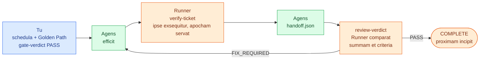

<!--
document_title: Coding Audit Harness
chinese_title: AI 寫的程式，驗過才算數
aka: []
established_date: 2026-09-29
updated_date: 2026-10-01
version: 3.1.0
-->

<div align="center">

# Coding Audit Harness

**Codex ab IA scriptus nisi probatus non valet**

[](LICENSE)
[](#installatio)

[繁體中文](README.md) · [简体中文](README.zh-CN.md) · [English](README.en.md) · [Français](README.fr.md) · Latina

[Quomodo operetur](#iter-schedulae-ab-initio-ad-finem) · [Installatio](#installatio) · [Initium celere](#initium-celere) · [Index mandatorum](#index-mandatorum) · [Fines fiduciae](#fines-fiduciae)

</div>

<br>

Postulatum aliquod agenti programmatorio (coding agent) committis. Post semihoram respondet: «Perfectum est; omnes probationes transierunt.»

Difficultas autem haec est: id confirmare nullo modo potes.

Non quia agenti diffidis, sed quia tibi nihil nisi sententiam dedit. Nihil eam sententiam ad certam codicis editionem alligat. Postquam rettulit, agens plicam `login.py` ter mutavit neque probationes umquam iterum exsecutus est. Probationes quas scripsit ea sola tegunt quae ipse excogitare potuit. «Transiit» dicit, sed nullum instrumentum notavit id factum esse, neque in qua codicis editione.

Hic est error maxime proprius programmationis per intellegentiam artificialem (IA). **Non quod codex scribi non possit, sed quod scriptum nemo probare possit.**

Coding Audit Harness una de causa exstat: **ut «probatum est» ex nuda affirmatione fiat testimonium quod investigari possit.**

(Vox «harness» hic significat stratum quod processum evolutionis circumdat et coercet, non instrumentum probationum quod «test harness» dicitur.)

Iudicare non potest utrum architectura tua bona sit aut probationes eleganter scriptae. Duo tantum facit: omne «transiit» sine testimonio prohibet, et examina acceptionis quae nulli postulato usoris respondent prohibet.

---

## Quinque partes systematis

| Pars | Imago | Quid re vera sit |
|---|---|---|
| **Audit skills** | Liber regularum | Quinque plicae Markdown ab agente legendae (`skills/*-audit/SKILL.md`), singulae singulis gradibus evolutionis. Quaeque enumerat condiciones quibus opus illius gradus satisfacere debet. |
| **Runner** | Arbiter | Programma lineae mandatorum (`harness/runner/runner.py`). Evolutioni non interest et unum tantum facit: inspicit num PASS testimonio suo nitatur. Si non, cum codice exitus non nullo exit. |
| **state.json** | Acta processus | Plica JSON in incepto tuo, quae notat quo gradu nunc sis, quo statu quaeque schedula sit, quae vitia nondum soluta sint. Unicus fons veritatis est; omne iudicium ex ea legitur. |
| **Testimonium verificationis**<br>`evidence` | Apocha | Quotiens mandatum acceptionis exsequitur, Runner apocham servat: quod mandatum currerit, quis codex exitus fuerit, quae summa (hash) codicis eo momento fuerit. |
| **Gate** | Porta | Porta quam **tu (homo)** aperire debes. Agens eam per se transire non potest. |

### Cur non satis sit agenti credere «probationes transierunt» dicenti

Officia sic divisa sunt:

- **Agens codicem scribit, probationes scribit, eventum refert.** Tres partes ab eodem exemplari (model) aguntur. Probationes ab eodem exemplari scriptae ea sola tegunt quae ipsum cogitavit. Quod omisit ipsum non videt, itaque nemo scit quid omissum sit.
- **Runner relationi agentis non credit, apochis solis credit.** Ipse mandata acceptionis iterum exsequitur, ipse summam codicis computat, ipse comparat. Si agens «probationes transierunt» dicit, Runner id pro nihilo habet.
- **Portam homo aperit.** Id mandatum tu solus das. Significat «inspexi et approbo», non «systema omnia recte se habere deprehendit».

Nulla trium partium alteram supplere potest: agens proponit, Runner cogit, operator approbat. Si una deest, processus consistit.

### Quinque artibus Matthaei Pocock innititur

Hoc harness per se neque specificationes neque codicem gignit. Haec a [quinque artibus (skills) Matthaei Pocock](https://github.com/mattpocock/skills) gignuntur; harness post quemque gradum opus inspicit. Quaeque ars `*-audit` aditus est: primum artem Matthaei respondentem vocat, exspectat dum finiatur, deinde opus suis regulis examinat. Si ars superior (upstream) deest, statim deficit neque praeterit.

| Gradus | Aditus (ars examinandi) | Ars Matthaei vocata | Opus | Coactio per Runner |
|---|---|---|---|---|
| DISCOVERY | `grill-me-audit` | `grill-me` | `PLAN.md` | Nulla |
| SPEC | `to-spec-audit` | `to-spec` | `SPEC.md` (cum User Stories `US-NNN`) | Nulla |
| TICKETS | `to-tickets-audit` | `to-tickets` | Schedulae, `golden_path.json` | Porta: graphum dependentiarum, examen cuiusque schedulae, examen cuiusque User Story |
| IMPLEMENTATION | `implement-audit` | `implement` (adhibet `tdd`) | Codex, apochae verificationis | `verify-ticket` ipse exsequitur et apochas servat |
| REVIEW | `code-review-audit` | `code-review` | Eventus recognitionis | Comparatio summae, criteriorum, vitiorum impedientium |

Artes Matthaei, una cum `grilling` et `tdd` quas vocant, in `skills/matt-upstream/` editione fixa sine ulla mutatione servantur.

> [!NOTE]
> Artes examinandi sunt regulae ab agente legendae, et examen agit idem agens qui artem Matthaei modo exsecutus est. In tribus gradibus posterioribus Runner extrinsecus per apochas et summas inspicit; in DISCOVERY et SPEC agens solum se ipsum inspicit. Hi duo gradus sunt ubi statuitur «quid re vera velimus». Itaque nunc, utrum opus id sit quod volebas, maxime pendet ex eo quod tu `SPEC.md` et `golden_path.json` ad Portam TICKETS perlegis. Runner ibi nihil nisi structuram praestare potest: omne examen ad aliquam User Story spectat, et omnis User Story examen habet. Utrum assertio id postulatum vere probet, tuum iudicium manet.

---

## Iter schedulae ab initio ad finem



Finge postulatum tuum esse «`add(2, 3)` 5 reddere debet». Haec re vera fiunt:

**1. Postulatum in schedulam scribis**
`.harness/tickets/T-001.md`. Schedula unam rem probabilem agit et dependentias suas (`depends_on`) declarat, quae ordinem exsecutionis statuunt.

**2. Modum probandi definis**
In `.harness/golden_path.json` definis quomodo probetur opus vere recte factum esse. Hic unum mandatum est, `python check_calc.py`, et `check_calc.py` continet `assert add(2, 3) == 5`. **Mandatum, si deficit, cum codice exitus non nullo exire debet.** Solum `OK` imprimere non est probare.

**3. Portam aperis: `gate-verdict --verdict PASS`**
Runner tunc quattuor facit: inspicit ne dependentiae in orbem redeant, **inspicit ut quaeque schedula saltem unum mandatum acceptionis habeat quod per se currere possit**, **inspicit ut omne examen alicui User Story in `SPEC.md` respondeat et omnis User Story examen habeat**, et summam consilii praesentis notat.

**4. Agens efficit, deinde `verify-ticket` exsequitur**
Runner mandatum acceptionis **ipse** exsequitur et eventum in apocha servat, quae summam codicis eo momento continet.

**5. Agens opus tradit**
Plicam `.harness/inbox/handoff.json` implet, quattuor campos ex apocha ad verbum transcribens.

**6. Recognitio proponitur: `review-verdict --verdict PASS`**
Eventus recognitionis eosdem quattuor campos transcribit. Runner tunc ultima examina agit:

- Summa codicis in apocha **etiamnunc codici praesenti respondetne?** (Mutavitne quisquam codicem post gradum quartum?)
- Habetne quisque passus acceptionis in apocha criterium «transiit» respondens in recognitione?
- Suntne vitia impedientia nondum soluta?

**7. Schedula perficitur**
Runner schedulam ut COMPLETE notat et proximam schedulam, cuius dependentiae iam satisfactae sunt, sponte incipit.

**8. Ultima schedula**
Runner insuper omnia mandata acceptionis ab initio iterum exsequitur. Si vel unum deficit, inceptum perfectum non notatur.

---

## Quid systema contineat

- Series quinque graduum: `DISCOVERY → SPEC → TICKETS → IMPLEMENTATION → REVIEW → COMPLETE`
- 25 optiones mandatorum Runner (quarum 3 expresse recusantur, ne verificatio circumveniatur), cum `state.json` ut unico fonte veritatis
- 5 artes examinandi, quae singulis gradibus condiciones acceptionis decernibiles definiunt
- Verificatio per Golden Path: quaeque schedula mandatum suum habere debet quod per se PASS/FAIL reddat, et quodque mandatum ad aliquam User Story in `SPEC.md` spectare debet
- Colligatio testimonii: `source_hash` (summa codicis) + `verification_id` (nota unica unius verificationis) + `review_round` (quotus circulus recognitionis) inter se alligantur, ut PASS ad alium codicis statum transferri non possit

### Quid non sit

- **Non est arca harenaria (sandbox).** Idem usor systematis statum, probationes, testimonia mutare potest. Summae recentiam probant, non sunt signa digitalia. Instrumentum errores cavet, non adversarium eadem potestate praeditum.
- **Nullum agentis ambitum habet.** Nullum LLM vocat, ad MCP non conectitur, nec interfaciem interretialem nec ordinatorem habet. Artes sunt plicae regularum ab agente legendae, non machina exsecutionis.
- **De qualitate non iudicat.** Architecturam tuam aut elegantiam probationum non aestimat. Haec iudicia criteriis recognitionis et Portae relinquuntur.
- **Collaborationem plurium usorum non sustinet.** Unus status, unus scriptor (sera clausus). Traditiones concurrentes nondum effectae sunt.

### Tria strata officiorum

| Stratum | Locus | Quis agat | Cui rei praesit |
|---|---|---|---|
| **Audit skills** | `skills/*-audit/SKILL.md` | Agens (regulas legit) | Definit quid opus cuiusque gradus praestare debeat; opus invalidum reicit |
| **Runner** | `harness/runner/` | CLI (cogit) | Inspicit testimonium adesse, summas congruere, processum non circumventum esse; aliter cum codice non nullo exit |
| **Operator (tu)** | — | Homo | `gate-verdict` / `decide` sunt **approbationes humanae**. Instrumentum numquam per se PASS pronuntiat |

> [!IMPORTANT]
> **Runner a gradu TICKETS regimen suscipit.** `init` gradum statim in `TICKETS` ponit (vide `initialize()` in `harness/runner/workflow.py`), itaque ad `DISCOVERY` et `SPEC` **nulla via per CLI ducit**. Condiciones acceptionis artium `grill-me-audit` et `to-spec-audit` nunc ab agente solo sponte servantur; Runner eas in gradu non cogit. Una exceptio est: Porta TICKETS indicem User Stories in `SPEC.md` legit et quomodo Golden Path ei respondeat inspicit. Si Runner hos duos gradus cogere vis, id nondum effectum est; vide [Deferred Items](docs/DEFERRED_ITEMS.md) (Sinice litteris traditis).

---

## Installatio

Python 3.12 requiritur (editio quam CI adhibet). Unica dependentia externa est `jsonschema>=4.18,<5` (`referencing` cum ea venit).

```powershell
python -m pip install -r requirements.txt
```

### Structura repositorii

```text
Coding-Audit-Harness/
├── harness/              # Runner CLI, schemata JSON, probationes
│   ├── runner/           # 12 moduli effectionis + 8 moduli probationum + adiutor fixturae communis
│   ├── *.schema.json    # 7 schemata (state / gate-result / review-result / handoff / finding / decision / change-impact)
│   └── state.schema.json
├── skills/
│   ├── *-audit/          # 5 involucra examinandi (huius incepti propria)
│   └── matt-upstream/    # artes superiores Matthaei Pocock (inclusae, non mutatae)
├── docs/                 # CHANGELOG / Deferred Items / Symbol-first Context
└── .github/workflows/    # CI Windows + Ubuntu
```

Data exsecutionis (`state.json`, schedulae, apochae) in **incepto destinato** creantur, non in hoc repositorio:

```text
<target-project>/.harness/
├── state.json                    # unicus fons veritatis
├── golden_path.json              # pars consilii approbati
├── tickets/T-NNN.md              # schedulae
├── inbox/                        # handoff.json / review.json a te scriptae
├── verifications/                # apochae a Runner generatae
├── reviews/                      # historia recognitionum a Runner generata
├── decisions/DEC-NNN.json        # acta decretorum
└── traceability/traceability.json
```

---

## Initium celere

Exemplum minimum quod re vera ab initio ad finem currit. Finge inceptum destinatum esse `C:\work\calc`.

### 0. Harness in inceptum destinatum pone

```powershell
Copy-Item -Recurse <this-repo>\harness C:\work\calc\harness
cd C:\work\calc
python -m pip install -r requirements.txt
```

**`harness/` intra inceptum destinatum esse debet**: Runner `harness/*.schema.json` relative ad `--project-root` legit. Si inceptum destinatum iam `.harness/` habet, **prius exemplar tutelae fac neque statum exstantem restitue**.

### 1. User Stories in SPEC.md scribe

`SPEC.md` (in radice incepti):

```markdown
# Spec

## User Stories

1. US-001: As a user, I want to add two numbers, so that I get their sum
```

Porta TICKETS ea sola elementa indicis legit quae a `US-NNN` incipiunt, intra sectionem cuius titulus «User Stories» continet (`1. US-001: ...`, `- US-001: ...`, `- **US-001**: ...` omnia accipiuntur). Si `SPEC.md` deest, si sectio nullum `US-NNN` habet, aut si nota bis occurrit, Porta recusat. In processu solito haec plica ab arte `to-spec-audit` gignitur.

### 2. Schedulam crea

`.harness/tickets/T-001.md`:

```markdown
---
id: T-001
depends_on: []
---

# T-001: Additio efficienda

- [ ] `add(2, 3)` 5 reddit
```

`depends_on` accipit `[T-001, T-002]` vel `[]`. Si omittitur, schedula nullas dependentias habet. YAML multilineare, valores virgulis inclusi, scalares, campi duplicati, formae vitiosae **omnia reiciuntur**.

### 3. Golden Path crea

`.harness/golden_path.json`:

```json
{
  "steps": [{
    "id": "GP-001",
    "description": "Additio recta est",
    "user_story_ids": ["US-001"],
    "ticket_ids": ["T-001"],
    "verification_command": ["python", "check_calc.py"],
    "expected_output": ""
  }]
}
```

`check_calc.py`:

```python
from calc import add
assert add(2, 3) == 5
```

Quisque passus (step) verificatio necessaria est. Mandata veras assertiones continere debent et, si deficiunt, cum codice non nullo exire; `print` fixum ad functionem probandam non sufficit.

**Quaeque schedula saltem unum passum habere debet cuius `ticket_ids` nihil nisi ipsam schedulam eiusque praerequisita contineant** (`depends_on` directa vel indirecta). Passus plures schedulas complectentes addi possunt, sed tum demum currunt cum omnes schedulae enumeratae COMPLETE sunt; **itaque numquam unica verificatio ullius schedulae esse possunt**. Cum Porta TICKETS PASS accipit, passus deficiens, passus sine mandato, aut passus schedulam ignotam citans recusatur.

**`user_story_ids` cuiusque passus vacua esse non possunt et eas solas notas citare possunt quae in `SPEC.md` definitae sunt; omnis User Story ab uno saltem passu mandatum habente citari debet.** Hac regula omne examen dicere potest quod postulatum probet. Passus plures User Stories enumerare potest, sed assertiones eius singulas vere probare debent; passus qui nihil nisi codicem currere probat nullum postulatum probat.

### 4. Optiones non necessariae

In summo gradu plicae `golden_path.json` ponuntur et pars consilii approbati sunt:

- **`source_hash_exclude`**: plicae a mandatis acceptionis generatae (formulae glob relativae), e.g. `[".coverage", "htmlcov", "dist", "*.log"]`. Sine hac optione, si mandatum ullam plicam scribit, `verify-ticket` cum `Project changed during verification` recusat. **Neque `.harness`, neque `*`, neque totum inceptum complecti potest; si codicem fontalem excludis, mutationes eius non deprehenduntur.**
- **`env_passthrough`**: nomina variabilium ambitus quibus mandata insuper egent.

### 5. Initia et Portam TICKETS transi

```powershell
python harness/runner/runner.py init
python harness/runner/runner.py set-ready-for-gate
python harness/runner/runner.py gate-verdict --verdict PASS
```

`init` statum creat in quo omnes schedulae TODO sunt, et **statum exstantem supprimere recusat**. Cum Porta TICKETS PASS accipit, Runner graphum dependentiarum et copiam schedularum confirmat, examina cuiusque schedulae et cuiusque User Story inspicit, summam consilii approbati notat (plicae schedularum + `golden_path.json` + `SPEC.md`), et primam schedulam exsequibilem incipit.

Non requiritur ut omnes schedulae praerequisitae ante initium operis perfectae sint.

### 6. Effice → proba → recognosce

```powershell
python harness/runner/runner.py verify-ticket --ticket T-001 --trust-commands
python harness/runner/runner.py mark-ticket-ready-for-review --ticket T-001
```

Exitus `verify-ticket`:

```json
{
  "ticket_id": "T-001",
  "review_round": 1,
  "source_hash": "<SHA-256 64 characterum>",
  "verification_id": "<uuid4 hex>",
  "all_passed": true,
  "results": [{"step_id": "GP-001", "status": "PASSED", "returncode": 0, "stdout": "", "stderr": ""}]
}
```

**Quattuor campos colligationis ad verbum in utrumque payload transcribe.** Quaevis mutatio codicis postea facta eos irritos reddit, et `verify-ticket` iterum exsequendum est.

`.harness/inbox/handoff.json`:

```json
{
  "ticket_id": "T-001",
  "review_round": 1,
  "source_hash": "<ex verify-ticket>",
  "verification_id": "<ex verify-ticket>",
  "changes": [{"file": "calc.py", "summary": "Additio effecta"}],
  "verification": [{"step": "python check_calc.py", "expected": "exit 0", "actual": "exit 0", "status": "PASS"}],
  "dependencies": []
}
```

`.harness/inbox/review.json`:

```json
{
  "ticket_id": "T-001",
  "review_round": 1,
  "source_hash": "<idem>",
  "verification_id": "<idem>",
  "verdict": "PASS",
  "criteria": [{"id": "GP-001", "status": "PASS", "critical": true}],
  "findings": []
}
```

**Quisque passus GP activus unum criterium habere debet cum `critical: true` et `PASS`.** Criteria manualia necessaria addita habere debent `status: "PASS"`, `source` (quis et ubi observaverit) et `limitations` (quae non tegantur); si quid horum trium deest, Runner ea reicit.

Textus manualis testimonium exsecutionis moderatae passus GP **supplere non potest**. Est declaratio operatoris expresse ut talis notata, non testimonium eiusdem generis.

```powershell
python harness/runner/runner.py review-verdict --ticket T-001 --verdict PASS `
  --review .harness/inbox/review.json --handoff .harness/inbox/handoff.json --trust-commands
python harness/runner/runner.py validate
python harness/runner/status.py --json
```

Cum schedula non ultima perficitur, idem status proximam schedulam TODO, cuius dependentiae perfectae sunt, sponte incipit.

---

## De serie graduum subtilius

### Portae graduum consilii

`DISCOVERY`, `SPEC` et `TICKETS` singulae tres eventus admittunt:

| Eventus | Effectus |
|---|---|
| `PASS` | Ad gradum proximum progreditur |
| `FIX_REQUIRED` | In gradu manet; stage_status ad `IN_PROGRESS` redit |
| `USER_DECISION_REQUIRED` | Inceptum intermittitur; `--decision-ref DEC-NNN` requiritur |

(Re vera CLI numquam nisi in `TICKETS` consistit; causam vide supra in sectione de tribus stratis.)

### Ultima schedula

Antequam proponatur, Runner **omnes passus Golden Path ipse iterum exsequitur** (Final Integrated Verification). Si quis passus FAIL / UNVERIFIED est, si scriptio artefacti deficit, aut si status confligit, COMPLETE non committitur.

Recognitor insuper unum criterium manuale addere debet:

```json
{"id": "FINAL_INTEGRATION", "status": "PASS", "critical": true,
 "source": "Omnes probationes exsecutae et cum moribus US-001 comparatae", "limitations": "Ambitus CI Windows non inclusus"}
```

### Mandata vetera expresse recusata

`complete-ticket`, `ready-for-review` et `increment-review` statim errorem reddunt et cum codice non nullo exeunt, quia testimonia verificationis et recognitionis circumvenire possent. Adhibe potius `mark-ticket-ready-for-review` + `review-verdict --review --handoff`.

`payload_validator.py` structuram veterum payload etiamnunc inspicit, sed **eam transire non est condicionibus perfectionis Workflow satisfacere**: Workflow separatim campos colligationis, contenta apocharum, statum vitiorum inspicit.

### Mutatio consilii approbati

Si post approbationem aliquid consilii mutatur (`golden_path.json`, plicae schedularum, `SPEC.md`), exempli gratia mandatum acceptionis relaxatum aut schedula decurtata, proximum `verify-ticket` vel `review-verdict` inceptum sponte intermittit cum causa `PLAN_CHANGE_REQUIRES_DECISION` et **nullum novum testimonium gignit**.

```powershell
python harness/runner/runner.py decide --option CONTINUE --rationale '...' --source '...'
python harness/runner/runner.py resume
```

`resume` graphum dependentiarum et examina (etiam correspondentiam cum User Stories) iterum inspicit et summam approbatam renovat. Novae schedulae ut TODO adduntur; **schedulas approbatas delere non licet**.

Si consilium post decretum iterum mutatur, resume novum decretum aperit. Etiam ad statum pristinum redire decretum requirit. Talis intermissio **mandato `pause` manu creari non potest**.

---

## Defectus et correctiones

### Verificatio deficit

Apocha defectus nihilominus servatur et CLI cum codice non nullo exit. **Codicem corrige et iterum exsequere; eventus veteres numquam iterum adhibentur.** Mutationes incepti dum verificatio fit etiam recusantur.

### Recognitio non transit

Adhibe `FIX_REQUIRED` cum uno saltem vitio impediente:

```json
{"finding_key": "wrong-addition", "criterion_ref": "GP-001",
 "description": "Summa numerorum negativorum falsa est", "blocking": true}
```

`finding_key` est **nota brevis (slug) quae idem vitium per circulos recognitionis constanter designat**. Cum idem vitium redit, **eadem nota iterum adhibenda est**.

`FIX_REQUIRED` neque traditionem neque apocham prosperam requirit, sed tamen rectum `ticket_id`, proximum `review_round` et `source_hash` (per `snapshot` obtinendum) requirit:

```powershell
python harness/runner/runner.py snapshot
python harness/runner/runner.py review-verdict --ticket T-001 --verdict FIX_REQUIRED --review .harness/inbox/review.json
python harness/runner/runner.py update-fix-memory --ticket T-001 --finding-data 'Additio negativorum correcta'
python harness/runner/runner.py resolve-finding --finding-id F-001
```

**Noli vitium solvere nisi correctione confirmata.** Si eadem `finding_key` iterum apparet, fit `REOPENED` et perfectionem etiamnunc impedit. Dum ullum vitium impediens OPEN vel REOPENED est, Runner PASS recusat.

### Post tres conatus, intermissio

`retry_limit` ex more 3 est. Eo attento, inceptum sponte intermittitur et nova plica `.harness/decisions/DEC-NNN.json` creatur; **historia numquam supprimitur**.

| Causa intermissionis | Unica optio admissa |
|---|---|
| `RETRY_LIMIT_REACHED` | `CONTINUE` |
| `PLAN_CHANGE_REQUIRES_DECISION` | `CONTINUE` |
| `GATE_USER_DECISION_REQUIRED` | `FIX_REQUIRED` |
| `REVIEW_USER_DECISION_REQUIRED` | `FIX_REQUIRED` |

Optiones nondum effectae, ut PASS override, ABORT, INVALIDATE, non offeruntur. `decision_context.options` eas solas optiones enumerare potest quae admittuntur.

```powershell
python harness/runner/runner.py decide --option CONTINUE --rationale 'Causa inventa; tres alii circuli correctionis probantur' --source 'operator localis'
python harness/runner/runner.py resume
```

Ratio vacua, `resolved: false`, `pause_id` obsoletum, schedula aut gradus falsus, optio invalida: omnia reiciuntur.

`CONTINUE` tres conatus addit. `review_attempts` numerum cumulatum FIX_REQUIRED servat, `review_total` omnes recognitiones numerat, `review_history` **numquam deletur**. Post resumptionem iterum corrigendum, probandum, ad recognitionem notandum, recognoscendum est.

### Intermissio manualis

```powershell
python harness/runner/runner.py pause --reason REVIEW_USER_DECISION_REQUIRED --decision-ref DEC-999
```

Intermissio ex editione vetere sine `pause_id` **decreta praeterita non sponte accipit**. Prius exemplar tutelae fac et processum in exemplari segregato reconstrue; **noli statum verum mutare ut verificationem circumvenias**. Instrumentum data exsecutionis vetera non sponte transfert.

---

## Index mandatorum

### `runner.py` (aditus principalis)

| Mandatum | Usus |
|---|---|
| `init` | Statum initialem creat (supprimere recusat) |
| `read` / `validate` | Statum legit / confirmat |
| `set-ready-for-gate` | Gradum praesentem Portae paratum notat |
| `gate-verdict --verdict` | Eventum Portae notat (**actio operatoris**) |
| `verify-ticket --ticket --trust-commands` | Golden Path exsequitur et apocham gignit |
| `mark-ticket-ready-for-review --ticket` | Schedulam recognitioni paratam notat |
| `review-verdict --ticket --verdict --review --handoff` | Eventum recognitionis proponit |
| `snapshot` | `source_hash` praesentem imprimit |
| `add-finding` / `resolve-finding` | Vitia manu tractat |
| `fix-loop-memory` / `update-fix-memory` | Acta correctionum inspicit / renovat |
| `pause` / `resume` / `decide` / `recover` | Moderatio processus et restitutio |
| `executable-tickets` / `next-ticket` / `blocked-tickets` / `validate-deps` | Quaestiones de dependentiis |
| `start-ticket` | Schedulam manu incipit (dependentiae inspiciuntur) |

Optiones universales: `--project-root` (ex more directorium praesens), `--trust-commands`, `--timeout` (ex more 60 secundae, spatium validum `0 < t <= 3600`), `--ticket`, `--verdict`, `--review`, `--handoff`, `--reason`, `--decision-ref`, `--finding-id`, `--finding-data`, `--option`, `--rationale`, `--source`.

Sine `--trust-commands`, `verify-ticket` et `review-verdict` ullum mandatum incepti exsequi recusant et `PermissionError` iaciunt. Hoc consulto fit, non est error.

### CLI auxiliares

| Scriptum | Mandata |
|---|---|
| `status.py` | `--json` (a machina legibile), `--project-root` |
| `traceability.py` | `create-scope` / `create-story` / `create-ticket` / `get` / `trace` / `validate` / `report` / `list` |
| `dependency_scheduler.py` | `validate` / `executable` / `next` / `blocked` / `can-start --ticket` |
| `payload_validator.py` | `<gate\|review\|finding\|handoff\|change-impact> --file [--strict]` |
| `run_tests.py` | `--output <path>` / `--legacy-only` |

`traceability.py` data sua in `.harness/traceability/traceability.json` servat et correspondentiam `SCOPE → USER_STORY → TICKET` notat. `status.py` quantum traceability tegat ostendit, sed **haec non est condicio perfectionis**: si nullae res traceability adsunt, schedula nihilominus perfici potest.

---

## Fines fiduciae

> [!WARNING]
> **JSON localis non est systema securitatis quod corrumpi nequeat.** Idem usor codicem, statum, probationes, testimonia mutare potest. Instrumentum errores, testimonia obsoleta, circumventionem processus per CLI solitam prohibet; usori malevolo eadem potestate praedito non resistit, neque de qualitate probationum aut recognitionum humanarum iudicat.

### `--trust-commands`

> [!CAUTION]
> Expresse permittit ut haec exsecutio mandata incepti exsequatur, cum **potestate usoris praesentis**. **Directorium laboris non est arca harenaria**: mandata ad omnes plicas et rete quibus usor utitur adhuc pervenire possunt. Sine hac permissione nihil exsequitur. Repositoria non fida prius in systema aut machinam virtualem vere segregatam pone; hoc instrumentum talem segregationem non praebet.

### Colatio variabilium ambitus

Ex more nihil transmittitur nisi PATH, viae systematis et instrumentorum (`SYSTEMROOT`, `USERPROFILE`, `APPDATA`, `LOCALAPPDATA`, `HOME`, `PROGRAMFILES` etc.), viae temporariae et locale; praeterea Python ad UTF-8 figitur neque bytecode scribit. **Neque tesserae (tokens) neque aliae variabiles hereditariae transmittuntur.** Si quod instrumentum aliam variabilem vere requirit, eam nominatim in `env_passthrough` plicae `golden_path.json` enumera.

Variabiles viarum non sunt credentialia: mandata iam plicas usoris legere possunt, quia haec non est arca harenaria.

### Purgatio processuum filiorum

In Windows adhibetur Job Object: processus suspensus creatur, iob assignatur, deinde resumitur. Tempore exspirato, errore, aut exitu solito iob clauditur, et omnes posteri terminantur. In POSIX adhibetur grex processuum; **processus qui gregem consulto relinquunt non praestantur.**

stdout/stderr in memoria et in artefactis servantur. **Ea sola mandata exsequere quae exitum modicum habent nec secreta imprimunt**: nullus terminus firmus nunc exstat.

---

## Mechanismi integritatis

### Summa contentorum

SHA-256 inceptis cum Git et sine Git convenit. **Git non initiat**, neque commit pro mutationibus nondum commissis habet. Plicas incepti ordinarias, schedulas, `golden_path.json` complectitur; ex more excludit `.git`, `__pycache__`, `.pytest_cache`, `.mypy_cache`, `.ruff_cache`, `.venv`, `venv`, `node_modules` et cetera data exsecutionis `.harness`, necnon ea quae in `source_hash_exclude` enumerantur.

**Numquam codicem negotii aut probationes quae verificantur exclude.** Tantum in inceptis fidis et secretis carentibus adhibe: summa contenta legit, quamquam testimonia nihil nisi digesta servant. Editiones instrumentorum et dependentiarum externarum statusque servitiorum **in summa non continentur**; ambitum fige aut iterum proba.

### Ratio incrementalis

Quaeque exsecutio **omnes** passus activos iterum exsequitur, sine ulla memoria temporaria (cache). Schedula praesens et schedulae perfectae pro activis habentur. Post mutationem codicis aut schedularum apochae veteres recusantur; mutatio contentorum dum verificatio fit etiam recusatur.

### Scriptio status

Sera plicae systematis et compare-and-swap SHA-256 in octetis lectis; scriptor obsoletus semper cum codice non nullo exit. Sera cum processus exit solvitur, et `writer.lock` suo loco manet; **noli plicam serae activam delere**. Si conflictus fit, iterum lege / restitue (read / recover), statum confirma, deinde operationem repete.

Artefacta **primum scribuntur, status postremo atomice substituitur**. Defectus artefactum orbum relinquere potest quod status non citat; **id non significat quicquam perfectum esse**. Restitutio ea sola artefacta adhibet quae status citat. Status corruptus nuntiatur, numquam coniectura reparatur; ex exemplari tutelae probato restituendus est.

Nulla firmitas praestatur contra defectum electricitatis totius machinae aut contra mutationes plicarum concurrentes et malevolas.

---

## Probationes exsequendae

```powershell
$env:PYTHONUTF8 = '1'
$env:PYTHONDONTWRITEBYTECODE = '1'
python harness/runner/run_tests.py
```

Quisque casus probationis suum inceptum temporarium creat, et CLI, schemata, schedulae, status omnia ad eandem fixturam spectant. Ex more JSON, acta, imagines CLI/status in `test-results/results.json` et `test-results/results.log` scribuntur (a Git neglecta), et **summae codicis et datorum `.harness/` exstantium ante et post exsecutionem comparantur**: si probatio quicquam tangit quod tangere non debet, exsecutio deficit.

`--legacy-only` greges `test_reliability` et `test_review_fixes` praeterit et solos sex modulos pristinos exsequitur. CI eodem aditu utitur; de eventibus remotis GitHub Actions auctoritatem habet.

---

## Documenta coniuncta

- [CHANGELOG](docs/CHANGELOG.md): historia correctionum firmitatis et purgationis repositorii (Sinice litteris traditis)
- [Symbol-first Context](docs/SYMBOL_FIRST_CONTEXT.md): symbola ante effectiones legenda, cum contextus codicis dilatatur (Anglice)
- [Deferred Items](docs/DEFERRED_ITEMS.md): quae expresse **non effecta** sunt, cum condicionibus retractandi (Sinice litteris traditis)

---

## Licentia

Partes huius incepti propriae sub [licentia MIT](LICENSE) eduntur.

Copyright (c) 2026 Liang Wei Dai (Alvin)

`skills/matt-upstream/` opus superius Matthaei Pocock continet (commit fixum `c55ee46`, die 2026-09-24 sumptum, **sine ulla mutatione locali**). De iure auctoris et nota MIT vide [LICENSE superiorem](skills/matt-upstream/LICENSE); de fonte et editione vide [UPSTREAM.md](skills/matt-upstream/UPSTREAM.md).
