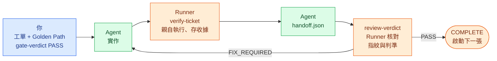

<!--
document_title: Coding Audit Harness
chinese_title: AI 寫的程式，驗過才算數
aka: []
established_date: 2026-09-29
updated_date: 2026-10-01
version: 3.1.0
-->

<div align="center">

# Coding Audit Harness

**AI 寫的程式，驗過才算數**

[](LICENSE)
[](#安裝)

繁體中文 · [简体中文](README.zh-CN.md) · [English](README.en.md) · [Français](README.fr.md) · [Latina](README.la.md)

[運作方式](#一張工單怎麼從頭走到尾) · [安裝](#安裝) · [快速上手](#快速上手) · [指令參考](#指令參考) · [信任邊界](#信任邊界)

</div>

<br>

你把一個需求交給 coding agent。半小時後它回覆：「實作完成，測試全部通過。」

問題是——你其實沒辦法確認這件事。

不是因為你不信任它，而是因為它給你的只是一句話。那句話沒有任何東西把它綁在某一版程式碼上。agent 報告完之後又改了三次 `login.py`，測試從來沒重跑；它寫的測試只覆蓋它自己想得到的那個 case；它說「通過」，但沒有任何工具記錄「通過」這件事發生過、發生在哪一版程式碼上。

這是 AI coding 最典型的失敗模式。**不是寫不出來，是寫完沒人驗得了。**

Coding Audit Harness 存在的理由就一句：**讓「驗收過」從一句話變成一份有據可查的證據。**

（`harness` 這個詞在這裡的意思是「套在開發流程外面、負責約束它的那一層框架」，不是測試用的 test harness。）

它判斷不了你的架構好不好、測試寫得漂不漂亮。它能做的是兩件事：擋下沒有證據的「通過」，以及擋下跟任何使用者需求都對不上的驗收。

---

## 這套系統由五個東西組成

| 元件 | 比喻 | 它其實是 |
|---|---|---|
| **Audit skills** | 規則書 | 5 份寫給 coding agent 讀的 Markdown 檔（`skills/*-audit/SKILL.md`）。每個開發階段一份，上面列「這個階段的產出物必須滿足什麼條件」。 |
| **Runner** | 裁判 | 一個 CLI 程式（`harness/runner/runner.py`）。它不參與開發，只做一件事：檢查「這個 PASS 有沒有對應的證據」。沒有就直接 exit 非 0。 |
| **state.json** | 流程紀錄 | 專案裡的一個 JSON 檔，記錄現在走到哪一階段、每張工單的狀態、有哪些還沒解決的問題。唯一的事實來源，所有判斷都從它讀。 |
| **驗證證據**<br>`evidence` | 驗收收據 | 每執行一次驗收指令，Runner 就存一份收據：跑了什麼指令、exit code 幾、當下程式碼的指紋是多少。 |
| **Gate** | 關卡 | 一個必須由**你（人）**按下「通過」的關卡。Agent 沒有權限自己過關。 |

### 為什麼不能只相信 Agent 說「測試通過」

分工是這樣的：

- **Agent 寫程式，也寫測試，也報告結果。** 三個角色是同一個模型。同一個模型寫出來的測試，只會蓋到它自己想得到的狀況。漏了什麼它自己看不到，於是沒有人知道它漏了什麼。
- **Runner 不相信 Agent 的報告，只相信收據。** 它自己重跑一次驗收指令，自己算一次程式碼指紋，再自己比對。Agent 說「測試通過」對它來說等於沒說。
- **Gate 是人按的。** 那道指令只有你會下。它代表「我看過了，我批准」，不是「系統偵測到一切正常」。

三者不能互相代替：Agent 提出，Runner 強制，Operator 核准，少一環流程就走不動。

### 接在 Matt Pocock 的五個技能後面

這套 harness 不自己產出規格或程式碼。產出靠 [Matt Pocock 的五個技能](https://github.com/mattpocock/skills)，harness 負責在每一步之後檢查產出物。每個 `*-audit` 技能都是入口：它先呼叫對應的 Matt 技能，等上游跑完，再用自己的規則檢查產出。上游技能不存在就直接失敗，不會跳過。

| 階段 | 入口（稽核技能） | 內部呼叫的 Matt 技能 | 產出物 | Runner 強制 |
|---|---|---|---|---|
| DISCOVERY | `grill-me-audit` | `grill-me` | `PLAN.md` | 無 |
| SPEC | `to-spec-audit` | `to-spec` | `SPEC.md`（含 `US-NNN` User Stories） | 無 |
| TICKETS | `to-tickets-audit` | `to-tickets` | 工單、`golden_path.json` | Gate：依賴圖、每張工單的驗收、每個 User Story 的驗收 |
| IMPLEMENTATION | `implement-audit` | `implement`（內含 `tdd`） | 程式碼、驗收收據 | `verify-ticket` 親自執行並存收據 |
| REVIEW | `code-review-audit` | `code-review` | 審查結果 | 指紋、判準、阻擋性問題比對 |

Matt 的技能連同它們呼叫的 `grilling`、`tdd`，固定版本放在 `skills/matt-upstream/`，沒有修改。

> [!NOTE]
> 稽核技能是寫給 agent 讀的規則，執行稽核的就是剛跑完 Matt 技能的那個 agent。後三個階段有 Runner 拿收據與指紋在外面檢查；DISCOVERY 與 SPEC 只有 agent 自己檢查自己。這兩段正是確認「我們要的是什麼」的地方，所以目前「做出來的是不是你要的」主要靠你在 TICKETS Gate 看過 `SPEC.md` 與 `golden_path.json`。Runner 在這裡能保證的只有結構：每條驗收都指向一個 User Story，每個 User Story 都有驗收；斷言有沒有真的驗到那個需求，仍要你判斷。

---

## 一張工單怎麼從頭走到尾



假設你說「`add(2, 3)` 要回傳 5」。實際上會發生的事：

**1. 你把需求寫成一張工單**
`.harness/tickets/T-001.md`。一張工單只做一件可驗收的事，並宣告依賴關係（`depends_on`）決定執行順序。

**2. 你寫好驗收方式**
`.harness/golden_path.json` 裡定義「怎麼證明這件事真的做對了」。對這個例子就是一條指令 `python check_calc.py`，而 `check_calc.py` 裡有一行 `assert add(2, 3) == 5`。**這條指令失敗時必須 exit 非 0**——只印一行 `OK` 不算驗收。

**3. 你按下 Gate：`gate-verdict --verdict PASS`**
Runner 這時做四件事：檢查依賴關係沒有死結、**檢查每張工單都至少有一條自己能獨立跑的驗收指令**、**檢查每條驗收都對應到 `SPEC.md` 裡的 User Story，且每個 User Story 都有驗收**、把「目前這份計畫」的指紋記下來。

**4. Agent 實作，然後跑 `verify-ticket`**
Runner **親自**執行那條驗收指令，把結果存成收據。收據上會寫進當下程式碼的指紋。

**5. Agent 交接**
填一份 `.harness/inbox/handoff.json`，把收據上的四個欄位原樣抄上去。

**6. 提交審查：`review-verdict --verdict PASS`**
審查結果同樣把那四個欄位抄上去。Runner 這時做最後的檢查：

- 這份收據的程式碼指紋，**跟現在的程式碼指紋還一樣嗎？**（第 4 步之後有人動過程式碼嗎？）
- 收據上每一條驗收步驟，審查結果裡是不是都有一條對應的「通過」判準？
- 有沒有還沒解決的阻擋性問題？

**7. 工單完成**
Runner 把工單標成 COMPLETE，並自動啟動下一張依賴已滿足的工單。

**8. 最後一張工單**
Runner 額外把所有驗收指令從頭再跑一遍。任何一條不過，整個專案不會標成完成。

---

## 系統包含什麼

- 五階段管線：`DISCOVERY → SPEC → TICKETS → IMPLEMENTATION → REVIEW → COMPLETE`
- 25 個 Runner 指令選項（其中 3 個已明確拒絕，以防止繞過驗收），以 `state.json` 為唯一事實來源
- 5 個 audit skills，替每個階段定義可判定的驗收條件
- Golden Path 驗證：每張工單都要有自己能獨立跑出 PASS/FAIL 的指令，每條指令都要指向 `SPEC.md` 的 User Story
- 證據綁定：`source_hash`（程式碼指紋）+ `verification_id`（單次驗證的唯一編號）+ `review_round`（第幾輪審查）三者綁定，PASS 不能用在別的程式碼狀態上

### 這不是什麼

- **不是 sandbox（沙箱）。** 同一個 OS 使用者可以改 state、改測試、改證據。雜湊是新鮮度檢查，不是數位簽章；工具防的是操作失誤，防不了同權限的攻擊者。
- **沒有 Agent runtime。** 不呼叫 LLM、不接 MCP、沒有 Web UI、沒有排程器。skills 是給 coding agent 讀的規則檔，不是執行引擎。
- **不做品質判斷。** 不評估你的架構好不好、測試寫得漂不漂亮。判斷題留給審查判準和 Gate。
- **不做多人協作。** 單一 state、單一 writer（會鎖）。並行 handoff 未實作。

### 三層分工

| 層 | 位置 | 誰在動 | 負責什麼 |
|---|---|---|---|
| **Audit skills** | `skills/*-audit/SKILL.md` | Agent（讀規則） | 定義每個階段產出物要滿足什麼條件；擋下無效產出 |
| **Runner** | `harness/runner/` | CLI（強制） | 驗證證據存在、雜湊對得上、流程沒被繞過；不合法就 exit 非 0 |
| **Operator（你）** | — | 人 | `gate-verdict` / `decide` 是**人做的核准**。工具不會自己宣告 PASS |

> [!IMPORTANT]
> **Runner 從 TICKETS 開始接管。** `init` 會直接把階段設為 `TICKETS`（見 `harness/runner/workflow.py` 的 `initialize()`），因此 `DISCOVERY` 與 `SPEC` 兩階段**沒有 CLI 路徑可以到達**——`grill-me-audit` 與 `to-spec-audit` 的驗收條件目前只由 agent 側自律執行，Runner 不做階段層強制。唯一的例外是 TICKETS Gate 會讀 `SPEC.md` 的 User Stories 清單，檢查它與 Golden Path 的對應。若你需要 Runner 強制這兩段，那是未實作項目，見 [Deferred Items](docs/DEFERRED_ITEMS.md)。

---

## 安裝

需要 Python 3.12（CI 指定版本）。唯一的第三方依賴是 `jsonschema>=4.18,<5`（`referencing` 是它的既有依賴）。

```powershell
python -m pip install -r requirements.txt
```

### 目錄結構

```text
Coding-Audit-Harness/
├── harness/              # CLI Runner、JSON Schema、正式測試
│   ├── runner/           # 12 個實作模組 + 8 個測試模組 + 共用 fixture helper
│   ├── *.schema.json    # 7 份 schema（state / gate-result / review-result / handoff / finding / decision / change-impact）
│   └── state.schema.json
├── skills/
│   ├── *-audit/          # 5 個 audit wrapper（本專案原創）
│   └── matt-upstream/    # Matt Pocock 上游技能（vendored，未修改）
├── docs/                 # CHANGELOG / Deferred Items / Symbol-first Context
└── .github/workflows/    # Windows + Ubuntu CI
```

執行時資料（`state.json`、工單、收據）建在**目標專案**裡，不在這個 repo：

```text
<target-project>/.harness/
├── state.json                    # 唯一事實來源
├── golden_path.json              # 已核准計畫的一部分
├── tickets/T-NNN.md              # 工單
├── inbox/                        # 你手寫的 handoff.json / review.json
├── verifications/                # Runner 產生的驗收收據
├── reviews/                      # Runner 產生的審查歷史
├── decisions/DEC-NNN.json        # 決策紀錄
└── traceability/traceability.json
```

---

## 快速上手

可實際跑通的最小例子。假設目標專案是 `C:\work\calc`。

### 0. 把 Harness 放進目標專案

```powershell
Copy-Item -Recurse <this-repo>\harness C:\work\calc\harness
cd C:\work\calc
python -m pip install -r requirements.txt
```

**`harness/` 必須在目標專案裡**——Runner 會相對於 `--project-root` 讀 `harness/*.schema.json`。若目標專案已有 `.harness/`，**先備份，不要重設既有狀態**。

### 1. 寫 SPEC.md 的 User Stories

`SPEC.md`（專案根目錄）：

```markdown
# Spec

## User Stories

1. US-001: As a user, I want to add two numbers, so that I get their sum
```

TICKETS Gate 只讀標題含「User Stories」的段落裡、以 `US-NNN` 開頭的清單項目（`1. US-001: ...`、`- US-001: ...`、`- **US-001**: ...` 都可以）。沒有 `SPEC.md`、段落裡沒有任何 `US-NNN`、或 ID 重複，Gate 都拒絕。正常流程下這份檔案由 `to-spec-audit` 產出。

### 2. 建立工單

`.harness/tickets/T-001.md`：

```markdown
---
id: T-001
depends_on: []
---

# T-001: 實作加法

- [ ] `add(2, 3)` 回傳 5
```

`depends_on` 支援 `[T-001, T-002]` 或 `[]`。未宣告視為無依賴。multiline YAML、引號值、scalar、重複欄位、格式錯誤**全部拒絕**。

### 3. 建立 Golden Path

`.harness/golden_path.json`：

```json
{
  "steps": [{
    "id": "GP-001",
    "description": "加法正確",
    "user_story_ids": ["US-001"],
    "ticket_ids": ["T-001"],
    "verification_command": ["python", "check_calc.py"],
    "expected_output": ""
  }]
}
```

`check_calc.py`：

```python
from calc import add
assert add(2, 3) == 5
```

每一個 step 都是必要驗證。指令要含真實 assertion，失敗時 exit 非 0；固定 `print` 不足以驗收功能。

**每張工單至少要有一個 step，其 `ticket_ids` 只含該工單本身加上它的前置工單**（直接或間接 `depends_on`）。跨多張工單的端到端 step 可以另外加，但只在所列工單全部 COMPLETE 後才執行，**不能當任何工單唯一的驗證**。TICKETS Gate PASS 時會檢查：缺 step、step 沒指令、step 引用不存在的工單，都拒絕。

**每個 step 的 `user_story_ids` 不能是空的，只能引用 `SPEC.md` 定義過的 ID；每個 User Story 都要被至少一個有指令的 step 引用。** 這條規則讓每條驗收都說得出「它在證明哪個需求」。一個 step 可以列多個 User Story，但斷言要真的驗到每一個；只證明程式跑得起來的 step，不算驗到任何需求。

### 4. 選用設定

寫在 `golden_path.json` 最上層，屬於核准計畫的一部分：

- **`source_hash_exclude`** — 驗收指令產生的檔案（相對路徑 glob），例如 `[".coverage", "htmlcov", "dist", "*.log"]`。不設定時，指令只要寫檔，`verify-ticket` 就會以 `Project changed during verification` 拒絕。**不能涵蓋 `.harness`、`*` 或整個專案；排除原始碼會讓它的變更偵測不到。**
- **`env_passthrough`** — 指令額外需要的環境變數名稱。

### 5. 初始化並通過 TICKETS Gate

```powershell
python harness/runner/runner.py init
python harness/runner/runner.py set-ready-for-gate
python harness/runner/runner.py gate-verdict --verdict PASS
```

`init` 建立全 TODO state，**拒絕覆寫既有 state**。TICKETS Gate PASS 時會：驗證依賴圖與工單集合、檢查每張工單與每個 User Story 的驗收涵蓋、記錄核准計畫的指紋（工單檔 + `golden_path.json` + `SPEC.md`）、啟動第一張可執行工單。

不要求所有前置工單在開工前已完成。

### 6. 實作 → 驗收 → 審查

```powershell
python harness/runner/runner.py verify-ticket --ticket T-001 --trust-commands
python harness/runner/runner.py mark-ticket-ready-for-review --ticket T-001
```

`verify-ticket` 輸出：

```json
{
  "ticket_id": "T-001",
  "review_round": 1,
  "source_hash": "<64 位 SHA-256>",
  "verification_id": "<uuid4 hex>",
  "all_passed": true,
  "results": [{"step_id": "GP-001", "status": "PASSED", "returncode": 0, "stdout": "", "stderr": ""}]
}
```

**把四個綁定欄位原樣抄進兩份 payload。** 這之後任何程式碼改動都會讓它們失效，必須重跑 `verify-ticket`。

`.harness/inbox/handoff.json`：

```json
{
  "ticket_id": "T-001",
  "review_round": 1,
  "source_hash": "<verify-ticket 輸出>",
  "verification_id": "<verify-ticket 輸出>",
  "changes": [{"file": "calc.py", "summary": "實作加法"}],
  "verification": [{"step": "python check_calc.py", "expected": "exit 0", "actual": "exit 0", "status": "PASS"}],
  "dependencies": []
}
```

`.harness/inbox/review.json`：

```json
{
  "ticket_id": "T-001",
  "review_round": 1,
  "source_hash": "<同上>",
  "verification_id": "<同上>",
  "verdict": "PASS",
  "criteria": [{"id": "GP-001", "status": "PASS", "critical": true}],
  "findings": []
}
```

**每個已啟用的 GP 都必須有一個 `critical: true` + `PASS` 的判準。** 額外的人工必要判準必須有 `status: "PASS"`、`source`（誰／何處觀察）、`limitations`（未涵蓋範圍），三個都缺 Runner 就拒收。

人工文字**不能取代** GP 的受控執行證據——它是明確標示的操作者聲明，不是同一層級的東西。

```powershell
python harness/runner/runner.py review-verdict --ticket T-001 --verdict PASS `
  --review .harness/inbox/review.json --handoff .harness/inbox/handoff.json --trust-commands
python harness/runner/runner.py validate
python harness/runner/status.py --json
```

非最後一張工單完成後，同一份 state 會自動啟動下一張依賴已完成的 TODO。

---

## 管線細節

### 規劃階段的 Gate

`DISCOVERY`、`SPEC`、`TICKETS` 各自支援三種結果：

| 結果 | 效果 |
|---|---|
| `PASS` | 前進到下一階段 |
| `FIX_REQUIRED` | 留在原階段，stage_status 回到 `IN_PROGRESS` |
| `USER_DECISION_REQUIRED` | 專案 pause，需 `--decision-ref DEC-NNN` |

（實務上 CLI 只會停在 `TICKETS`，理由見上方三層分工的說明。）

### 最後一張工單

提交前 Runner 會**自己重跑全部 Golden Path steps**（Final Integrated Verification）。任何 step FAIL／UNVERIFIED、artifact 寫入失敗、state 衝突，都不提交 COMPLETE。

審查者另外要補一個人工判準：

```json
{"id": "FINAL_INTEGRATION", "status": "PASS", "critical": true,
 "source": "執行完整測試套件並對照 US-001 行為", "limitations": "未涵蓋 Windows CI 環境"}
```

### 已明確拒絕的舊指令

`complete-ticket`、`ready-for-review`、`increment-review` 會直接報錯並 exit 非 0。理由：這三個指令可以繞過驗收與審查證據。請用 `mark-ticket-ready-for-review` + `review-verdict --review --handoff`。

`payload_validator.py` 保留舊 payload 結構檢查，但**通過它不代表通過 Workflow 完成條件**——Workflow 會另外檢查綁定欄位、收據內容、finding 狀態。

### 已核准計畫變更

核准後（`golden_path.json`、工單檔、`SPEC.md`）若有變更——例如放寬驗收指令、刪減工單內容——下一次 `verify-ticket` 或 `review-verdict` 會自動 pause，reason 為 `PLAN_CHANGE_REQUIRES_DECISION`，**不產生新證據**。

```powershell
python harness/runner/runner.py decide --option CONTINUE --rationale '...' --source '...'
python harness/runner/runner.py resume
```

`resume` 會重新檢查依賴圖與驗收涵蓋（含 User Story 對應），並更新核准指紋。新工單以 TODO 加入，**不支援刪除已核准工單**。

決策後計畫又變 → resume 會再開一個新決策。改回原狀也需要決策確認。此類 pause **不能用 `pause` 指令手動建立**。

---

## 失敗與修正

### 驗收失敗

仍然保存失敗收據，CLI exit 非 0。**修正程式後重跑，不沿用舊結果。** 驗收期間專案內容改動也會拒絕。

### 審查不通過

用 `FIX_REQUIRED`，至少一個阻擋性問題：

```json
{"finding_key": "wrong-addition", "criterion_ref": "GP-001",
 "description": "負數相加結果不對", "blocking": true}
```

`finding_key` 是**跨審查輪次穩定識別同一問題的 slug**。同一問題再次出現時**必須重用同一個 key**。

`FIX_REQUIRED` 不要求成功 handoff／收據，但仍須正確 `ticket_id`、下一個 `review_round`、`source_hash`（用 `snapshot` 取得）：

```powershell
python harness/runner/runner.py snapshot
python harness/runner/runner.py review-verdict --ticket T-001 --verdict FIX_REQUIRED --review .harness/inbox/review.json
python harness/runner/runner.py update-fix-memory --ticket T-001 --finding-data '修正負數加法'
python harness/runner/runner.py resolve-finding --finding-id F-001
```

**確認修復後才 resolve。** 同 `finding_key` 再出現會變成 `REOPENED`，仍阻止完成。有 OPEN 或 REOPENED 的阻擋性問題時，Runner 拒收 PASS。

### 三次之後 → pause

預設 `retry_limit` 為 3。達到時自動 pause，產生新的 `.harness/decisions/DEC-NNN.json`，**不覆寫歷史紀錄**。

| Pause reason | 唯一支援的選項 |
|---|---|
| `RETRY_LIMIT_REACHED` | `CONTINUE` |
| `PLAN_CHANGE_REQUIRES_DECISION` | `CONTINUE` |
| `GATE_USER_DECISION_REQUIRED` | `FIX_REQUIRED` |
| `REVIEW_USER_DECISION_REQUIRED` | `FIX_REQUIRED` |

不顯示 PASS override、ABORT、INVALIDATE 等未實作選項。`decision_context.options` 也只能列支援的選項。

```powershell
python harness/runner/runner.py decide --option CONTINUE --rationale '已找出原因，批准再修三輪' --source '本機操作者'
python harness/runner/runner.py resume
```

空白 rationale、`resolved: false`、舊 `pause_id`、錯工單／階段、無效選項全部拒絕。

`CONTINUE` 增加三次額度；`review_attempts` 保留累積的 FIX_REQUIRED 次數，`review_total` 記錄所有審查，`review_history` **不清除**。恢復後要重新修正、驗收、標記待審、審查。

### 手動 pause

```powershell
python harness/runner/runner.py pause --reason REVIEW_USER_DECISION_REQUIRED --decision-ref DEC-999
```

舊版沒有 `pause_id` 的 pause **不會自動接受歷史決策**。需先備份，在隔離副本重建新流程，**不以改正式 state 規避驗收**。工具不會自動遷移舊版 runtime。

---

## 指令參考

### `runner.py`（主要入口）

| 指令 | 用途 |
|---|---|
| `init` | 建立初始 state（拒絕覆蓋） |
| `read` / `validate` | 讀取 / 驗證 state |
| `set-ready-for-gate` | 標記當前階段可送 Gate |
| `gate-verdict --verdict` | 記錄 Gate 結果（**操作者動作**） |
| `verify-ticket --ticket --trust-commands` | 執行 Golden Path，產生收據 |
| `mark-ticket-ready-for-review --ticket` | 標記工單待審查 |
| `review-verdict --ticket --verdict --review --handoff` | 提交審查結果 |
| `snapshot` | 印出當前 `source_hash` |
| `add-finding` / `resolve-finding` | 手動管理問題 |
| `fix-loop-memory` / `update-fix-memory` | 檢視 / 更新修正紀錄 |
| `pause` / `resume` / `decide` / `recover` | 流程控制與復原 |
| `executable-tickets` / `next-ticket` / `blocked-tickets` / `validate-deps` | 相依關係查詢 |
| `start-ticket` | 手動啟動工單（會檢查依賴） |

全域參數：`--project-root`（預設 cwd）、`--trust-commands`、`--timeout`（預設 60 秒，合法範圍 `0 < t <= 3600`）、`--ticket`、`--verdict`、`--review`、`--handoff`、`--reason`、`--decision-ref`、`--finding-id`、`--finding-data`、`--option`、`--rationale`、`--source`。

未帶 `--trust-commands` 時，`verify-ticket` 與 `review-verdict` 會直接以 `PermissionError` 拒絕執行任何專案指令——這是刻意的，不是錯誤。

### 輔助 CLI

| 腳本 | 指令 |
|---|---|
| `status.py` | `--json`（機器可讀）、`--project-root` |
| `traceability.py` | `create-scope` / `create-story` / `create-ticket` / `get` / `trace` / `validate` / `report` / `list` |
| `dependency_scheduler.py` | `validate` / `executable` / `next` / `blocked` / `can-start --ticket` |
| `payload_validator.py` | `<gate\|review\|finding\|handoff\|change-impact> --file [--strict]` |
| `run_tests.py` | `--output <path>` / `--legacy-only` |

`traceability.py` 存放於 `.harness/traceability/traceability.json`，記錄 `SCOPE → USER_STORY → TICKET` 之間的對應關係。`status.py` 會顯示 traceability 覆蓋率，但**它不是完成條件**——沒有 traceability entity 不會阻擋工單完成。

---

## 信任邊界

> [!WARNING]
> **本機 JSON 不是不可竄改的安全系統。** 同使用者能改程式、state、測試與證據。工具防止操作失誤、過期證據及正常 CLI 的流程繞過；不抵抗惡意同權限使用者，也不判斷測試或人工審查的品質。

### `--trust-commands`

> [!CAUTION]
> 明確授權本次執行專案指令，以**目前使用者權限**運作。**cwd 不是 sandbox**——指令仍可存取使用者有權限的檔案與網路。未授權不執行。不可信 repository 請先放進真正隔離的 OS／VM，本工具不提供該隔離。

### 環境變數過濾

預設只傳 PATH、系統與工具鏈路徑（`SYSTEMROOT`、`USERPROFILE`、`APPDATA`、`LOCALAPPDATA`、`HOME`、`PROGRAMFILES` 等）、暫存路徑與 locale，另固定 Python UTF-8／不寫 bytecode。**不傳 token 或其他繼承變數。** 工具確實需要的其他變數，在 `golden_path.json` 的 `env_passthrough` 逐一列名。

路徑變數不是憑證——指令本來就能讀使用者檔案，因為這不是 sandbox。

### 子程序清理

Windows 使用 Job Object，在 suspended spawn 後指派再恢復執行；timeout、錯誤與正常退出皆關閉 job，終止所屬後代。POSIX 使用 process group；**主動脫離 group 的程序不受保證。**

stdout/stderr 儲存在記憶體及 artifact 中。**只執行輸出量合理、無機密輸出的指令**——目前沒有硬上限。

---

## 完整性機制

### 內容雜湊

SHA-256 適用有 Git 或無 Git 的專案，**不初始化 Git**，也不以 commit 代替未提交變更。納入一般專案檔、工單與 `golden_path.json`；預設排除 `.git`、`__pycache__`、`.pytest_cache`、`.mypy_cache`、`.ruff_cache`、`.venv`、`venv`、`node_modules` 與其他 `.harness` runtime，另加 `source_hash_exclude` 所列項目。

**排除範圍不得放待驗收的業務程式或測試。** 只在可信、不含 secrets 的專案使用——雜湊需讀內容，但證據僅存摘要。外部工具／依賴版本與服務狀態**不在雜湊內**，需固定環境或重新驗證。

### Incremental 策略

每次重跑**全部**已啟用 steps，不沿用 cache。當前與已完成工單都算啟用。程式或工單變更後拒絕舊收據，驗收期間內容變動也拒絕。

### State 寫入

OS file lock + 讀取 bytes SHA-256 compare-and-swap，stale writer 一律非 0。lock 隨程序退出釋放，`writer.lock` 留在原處，**不要刪除活躍 lock 檔**。衝突時重新 read／recover，確認狀態後重做。

Artifact **先寫，state 最後原子替換**。失敗可能留下未被 state 引用的孤立 artifact，**那不代表完成**；恢復只採 state 引用的。損毀 state 只報錯，不猜測修復，需從已驗證備份恢復。

未提供整機斷電耐久性或惡意並行改檔保證。

---

## 執行測試

```powershell
$env:PYTHONUTF8 = '1'
$env:PYTHONDONTWRITEBYTECODE = '1'
python harness/runner/run_tests.py
```

每個案例自行建立 temporary project，CLI、schema、工單、state 指同一 fixture。預設將 JSON、log、CLI/state 快照寫到 `test-results/results.json` 與 `test-results/results.log`（已排除於 Git），並**核對測試前後的程式碼雜湊與既有 `.harness/` 資料雜湊**——測試若污染了不該動的東西，會直接判定失敗。

`--legacy-only` 會跳過 `test_reliability` 與 `test_review_fixes` 兩組，僅跑原本的六個模組。CI 使用相同入口，遠端執行結果以 GitHub Actions 為準。

---

## 相關文件

- [CHANGELOG](docs/CHANGELOG.md) — 可靠性修復與目錄整理紀錄
- [Symbol-first Context](docs/SYMBOL_FIRST_CONTEXT.md) — 讀碼時先看符號再看實作的展開原則
- [Deferred Items](docs/DEFERRED_ITEMS.md) — 明確**未實作**的項目，含 reconsideration trigger

---

## 授權

本專案原創部分採用 [MIT License](LICENSE)。

Copyright (c) 2026 Liang Wei Dai (Alvin)

`skills/matt-upstream/` 包含 Matt Pocock 的上游作品（pinned commit `c55ee46`，擷取於 2026-09-24，**無本地修改**），其著作權與 MIT 授權聲明見 [上游 LICENSE](skills/matt-upstream/LICENSE)，來源及版本見 [UPSTREAM.md](skills/matt-upstream/UPSTREAM.md)。