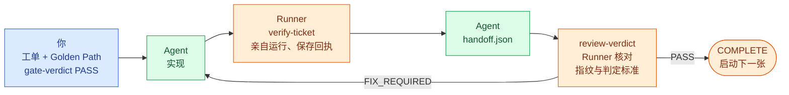

<!--
document_title: Coding Audit Harness
chinese_title: AI 写的代码，验过才算数
aka: []
established_date: 2026-09-29
updated_date: 2026-10-01
version: 3.1.0
-->

<div align="center">

# Coding Audit Harness

**AI 写的代码，验过才算数**

[](LICENSE)
[](#安装)

[繁體中文](README.md) · 简体中文 · [English](README.en.md) · [Français](README.fr.md)

[工作原理](#一张工单怎么从头走到尾) · [安装](#安装) · [快速上手](#快速上手) · [命令参考](#命令参考) · [信任边界](#信任边界)

</div>

<br>

你把一个需求交给 coding agent。半小时后它回复：“实现完成，测试全部通过。”

问题是，你其实没法确认这件事。

不是因为你不信任它，而是因为它给你的只是一句话。这句话没有跟任何一个版本的代码绑定。agent 汇报完之后又改了三次 `login.py`，测试一次都没重跑；它写的测试只覆盖它自己想得到的那个 case；它说“通过”，但没有任何工具记录“通过”这件事发生过、发生在哪个版本的代码上。

这是 AI 编程最典型的失败模式。**不是写不出来，而是写完没人验得了。**

Coding Audit Harness 存在的理由只有一句：**让“验收过”从一句话变成一份可追溯的证据。**

（这里的 `harness` 指“套在开发流程外面、负责约束它的那一层框架”，不是测试用的 test harness。）

它判断不了你的架构好不好、测试写得漂不漂亮。它能做的是两件事：拦下没有证据的“通过”，以及拦下跟任何用户需求都对不上的验收。

---

## 这套系统由五部分组成

| 组件 | 比喻 | 它实际上是 |
|---|---|---|
| **Audit skills** | 规则手册 | 5 份写给 coding agent 读的 Markdown 文件（`skills/*-audit/SKILL.md`）。每个开发阶段一份，列出“这个阶段的产出必须满足哪些条件”。 |
| **Runner** | 裁判 | 一个 CLI 程序（`harness/runner/runner.py`）。它不参与开发，只做一件事：检查“这个 PASS 有没有对应的证据”。没有就直接以非 0 退出。 |
| **state.json** | 流程记录 | 项目里的一个 JSON 文件，记录当前走到哪个阶段、每张工单的状态、还有哪些没解决的问题。它是唯一的事实来源，所有判断都从它读取。 |
| **验证证据**<br>`evidence` | 验收回执 | 每运行一次验收命令，Runner 就保存一份回执：运行了什么命令、退出码是多少、当时代码的指纹是什么。 |
| **Gate** | 关卡 | 一个必须由**你（人）**点“通过”的关卡。Agent 没有权限自己过关。 |

### 为什么不能只相信 Agent 说“测试通过”

分工是这样的：

- **Agent 写代码、写测试、也汇报结果。** 三个角色是同一个模型。同一个模型写的测试，只会覆盖它自己想得到的情况。它漏掉了什么自己看不到，于是也没人知道漏了什么。
- **Runner 不相信 Agent 的汇报，只相信回执。** 它自己重跑一遍验收命令，自己算一遍代码指纹，再自己比对。Agent 说“测试通过”，对它来说等于没说。
- **Gate 由人来按。** 那条命令只有你会执行。它的意思是“我看过了，我批准”，而不是“系统检测到一切正常”。

三者不能互相替代：Agent 提出，Runner 强制，Operator 批准，少了任何一环流程都走不下去。

### 接在 Matt Pocock 的五个技能后面

这套 harness 本身不产出规格或代码。产出靠 [Matt Pocock 的五个技能](https://github.com/mattpocock/skills)，harness 负责在每一步之后检查产出。每个 `*-audit` 技能都是入口：它先调用对应的 Matt 技能，等上游跑完，再用自己的规则检查产出。上游技能不存在就直接失败，不会跳过。

| 阶段 | 入口（审计技能） | 内部调用的 Matt 技能 | 产出 | Runner 强制 |
|---|---|---|---|---|
| DISCOVERY | `grill-me-audit` | `grill-me` | `PLAN.md` | 无 |
| SPEC | `to-spec-audit` | `to-spec` | `SPEC.md`（含 `US-NNN` User Stories） | 无 |
| TICKETS | `to-tickets-audit` | `to-tickets` | 工单、`golden_path.json` | Gate：依赖图、每张工单的验收、每个 User Story 的验收 |
| IMPLEMENTATION | `implement-audit` | `implement`（内含 `tdd`） | 代码、验收回执 | `verify-ticket` 亲自运行并保存回执 |
| REVIEW | `code-review-audit` | `code-review` | 评审结果 | 指纹、判定标准、阻塞性问题比对 |

Matt 的技能连同它们调用的 `grilling`、`tdd`，以固定版本放在 `skills/matt-upstream/`，未做修改。

> [!NOTE]
> 审计技能是写给 agent 读的规则，执行审计的就是刚跑完 Matt 技能的那个 agent。后三个阶段有 Runner 拿回执和指纹在外部检查；DISCOVERY 和 SPEC 只有 agent 自己检查自己。这两个阶段恰恰是确认“我们要的是什么”的地方，所以目前“做出来的是不是你要的”主要靠你在 TICKETS Gate 审阅 `SPEC.md` 和 `golden_path.json`。Runner 在这里能保证的只有结构：每条验收都指向一个 User Story，每个 User Story 都有验收；断言有没有真正验证到那个需求，仍然要你来判断。

---

## 一张工单怎么从头走到尾



假设你的需求是“`add(2, 3)` 要返回 5”。实际会发生的事：

**1. 你把需求写成一张工单**
`.harness/tickets/T-001.md`。一张工单只做一件可验收的事，并声明依赖关系（`depends_on`）来决定执行顺序。

**2. 你写好验收方式**
在 `.harness/golden_path.json` 里定义“怎么证明这件事真的做对了”。在这个例子里就是一条命令 `python check_calc.py`，而 `check_calc.py` 里有一行 `assert add(2, 3) == 5`。**这条命令失败时必须以非 0 退出**，只打印一行 `OK` 不算验收。

**3. 你通过 Gate：`gate-verdict --verdict PASS`**
Runner 此时做四件事：检查依赖关系没有死循环、**检查每张工单都至少有一条能独立运行的验收命令**、**检查每条验收都对应到 `SPEC.md` 里的 User Story，并且每个 User Story 都有验收**、记录下“当前这份计划”的指纹。

**4. Agent 实现，然后运行 `verify-ticket`**
Runner **亲自**运行那条验收命令，把结果保存成回执。回执上会写入当时代码的指纹。

**5. Agent 交接**
填写 `.harness/inbox/handoff.json`，把回执上的四个字段原样抄过去。

**6. 提交评审：`review-verdict --verdict PASS`**
评审结果同样要抄上这四个字段。Runner 此时做最后的检查：

- 这份回执的代码指纹，**跟现在的代码指纹还一致吗？**（第 4 步之后有人改过代码吗？）
- 回执上的每一个验收步骤，评审结果里是否都有一条对应的“通过”判定标准？
- 还有没有未解决的阻塞性问题？

**7. 工单完成**
Runner 把工单标记为 COMPLETE，并自动启动下一张依赖已满足的工单。

**8. 最后一张工单**
Runner 会额外把所有验收命令从头再跑一遍。任何一条不通过，整个项目都不会标记为完成。

---

## 系统包含什么

- 五阶段流水线：`DISCOVERY → SPEC → TICKETS → IMPLEMENTATION → REVIEW → COMPLETE`
- 25 个 Runner 命令选项（其中 3 个已明确禁用，防止绕过验收），以 `state.json` 为唯一事实来源
- 5 个 audit skills，为每个阶段定义可判定的验收条件
- Golden Path 验证：每张工单都要有自己能独立跑出 PASS/FAIL 的命令，每条命令都要指向 `SPEC.md` 里的 User Story
- 证据绑定：`source_hash`（代码指纹）+ `verification_id`（单次验证的唯一编号）+ `review_round`（第几轮评审）三者绑定，PASS 不能挪用到别的代码状态上

### 它不是什么

- **不是沙箱。** 同一个操作系统用户可以改 state、改测试、改证据。哈希只是新鲜度检查，不是数字签名；工具防的是操作失误，防不了同权限的攻击者。
- **没有 Agent 运行时。** 不调用 LLM、不接 MCP、没有 Web UI、没有调度器。skills 是给 coding agent 读的规则文件，不是执行引擎。
- **不做质量判断。** 不评估你的架构好不好、测试写得漂不漂亮。这类判断交给评审标准和 Gate。
- **不支持多人协作。** 单一 state、单一写入者（有锁）。并发 handoff 尚未实现。

### 三层分工

| 层 | 位置 | 谁在操作 | 负责什么 |
|---|---|---|---|
| **Audit skills** | `skills/*-audit/SKILL.md` | Agent（读规则） | 定义每个阶段的产出要满足什么条件；拦下无效产出 |
| **Runner** | `harness/runner/` | CLI（强制执行） | 验证证据存在、哈希一致、流程没被绕过；不合规就以非 0 退出 |
| **Operator（你）** | — | 人 | `gate-verdict` / `decide` 是**人做的批准**。工具不会自己宣布 PASS |

> [!IMPORTANT]
> **Runner 从 TICKETS 阶段开始接管。** `init` 会直接把阶段设为 `TICKETS`（见 `harness/runner/workflow.py` 的 `initialize()`），因此 `DISCOVERY` 和 `SPEC` 两个阶段**没有 CLI 路径可以到达**：`grill-me-audit` 和 `to-spec-audit` 的验收条件目前只靠 agent 自觉执行，Runner 不做阶段层面的强制。唯一的例外是 TICKETS Gate 会读取 `SPEC.md` 的 User Stories 列表，检查它和 Golden Path 的对应关系。如果你需要 Runner 强制这两个阶段，那属于未实现项，见 [Deferred Items](docs/DEFERRED_ITEMS.md)（繁体中文）。

---

## 安装

需要 Python 3.12（CI 指定版本）。唯一的第三方依赖是 `jsonschema>=4.18,<5`（`referencing` 是它自带的依赖）。

```powershell
python -m pip install -r requirements.txt
```

### 目录结构

```text
Coding-Audit-Harness/
├── harness/              # CLI Runner、JSON Schema、正式测试
│   ├── runner/           # 12 个实现模块 + 8 个测试模块 + 共用 fixture helper
│   ├── *.schema.json    # 7 份 schema（state / gate-result / review-result / handoff / finding / decision / change-impact）
│   └── state.schema.json
├── skills/
│   ├── *-audit/          # 5 个 audit wrapper（本项目原创）
│   └── matt-upstream/    # Matt Pocock 上游技能（vendored，未修改）
├── docs/                 # CHANGELOG / Deferred Items / Symbol-first Context
└── .github/workflows/    # Windows + Ubuntu CI
```

运行时数据（`state.json`、工单、回执）建在**目标项目**里，不在这个仓库里：

```text
<target-project>/.harness/
├── state.json                    # 唯一事实来源
├── golden_path.json              # 已批准计划的一部分
├── tickets/T-NNN.md              # 工单
├── inbox/                        # 你手写的 handoff.json / review.json
├── verifications/                # Runner 生成的验收回执
├── reviews/                      # Runner 生成的评审历史
├── decisions/DEC-NNN.json        # 决策记录
└── traceability/traceability.json
```

---

## 快速上手

一个能实际跑通的最小示例。假设目标项目是 `C:\work\calc`。

### 0. 把 Harness 放进目标项目

```powershell
Copy-Item -Recurse <this-repo>\harness C:\work\calc\harness
cd C:\work\calc
python -m pip install -r requirements.txt
```

**`harness/` 必须放在目标项目里**：Runner 会相对于 `--project-root` 读取 `harness/*.schema.json`。如果目标项目已经有 `.harness/`，**先备份，不要重置已有状态**。

### 1. 写 SPEC.md 的 User Stories

`SPEC.md`（项目根目录）：

```markdown
# Spec

## User Stories

1. US-001: As a user, I want to add two numbers, so that I get their sum
```

TICKETS Gate 只读取标题包含“User Stories”的段落中、以 `US-NNN` 开头的列表项（`1. US-001: ...`、`- US-001: ...`、`- **US-001**: ...` 都可以）。没有 `SPEC.md`、段落里没有任何 `US-NNN`、或者 ID 重复，Gate 都会拒绝。正常流程中这个文件由 `to-spec-audit` 生成。

### 2. 创建工单

`.harness/tickets/T-001.md`：

```markdown
---
id: T-001
depends_on: []
---

# T-001: 实现加法

- [ ] `add(2, 3)` 返回 5
```

`depends_on` 支持 `[T-001, T-002]` 或 `[]`。未声明视为无依赖。多行 YAML、带引号的值、标量、重复字段、格式错误**一律拒绝**。

### 3. 创建 Golden Path

`.harness/golden_path.json`：

```json
{
  "steps": [{
    "id": "GP-001",
    "description": "加法正确",
    "user_story_ids": ["US-001"],
    "ticket_ids": ["T-001"],
    "verification_command": ["python", "check_calc.py"],
    "expected_output": ""
  }]
}
```

`check_calc.py`：

```python
from calc import add
assert add(2, 3) == 5
```

每个 step 都是必需的验证。命令里要有真正的断言，失败时以非 0 退出；固定输出一句 `print` 不足以验收功能。

**每张工单至少要有一个 step，它的 `ticket_ids` 只包含这张工单本身加上它的前置工单**（直接或间接的 `depends_on`）。跨多张工单的端到端 step 可以额外添加，但只有在所列工单全部 COMPLETE 后才会运行，**不能作为任何工单唯一的验证**。TICKETS Gate PASS 时会检查：缺少 step、step 没有命令、step 引用了不存在的工单，都会拒绝。

**每个 step 的 `user_story_ids` 不能为空，只能引用 `SPEC.md` 里定义过的 ID；每个 User Story 都必须被至少一个带命令的 step 引用。** 这条规则让每条验收都说得清“它在证明哪个需求”。一个 step 可以列多个 User Story，但断言要真正验证到每一个；只证明代码能跑起来的 step，不算验证了任何需求。

### 4. 可选配置

写在 `golden_path.json` 的最顶层，属于已批准计划的一部分：

- **`source_hash_exclude`**：验收命令生成的文件（相对路径 glob），例如 `[".coverage", "htmlcov", "dist", "*.log"]`。不配置的话，命令只要写了文件，`verify-ticket` 就会以 `Project changed during verification` 拒绝。**不能覆盖 `.harness`、`*` 或整个项目；排除源代码会导致它的改动检测不到。**
- **`env_passthrough`**：命令额外需要的环境变量名。

### 5. 初始化并通过 TICKETS Gate

```powershell
python harness/runner/runner.py init
python harness/runner/runner.py set-ready-for-gate
python harness/runner/runner.py gate-verdict --verdict PASS
```

`init` 创建全部为 TODO 的 state，**拒绝覆盖已有 state**。TICKETS Gate PASS 时会：验证依赖图与工单集合、检查每张工单和每个 User Story 的验收覆盖、记录已批准计划的指纹（工单文件 + `golden_path.json` + `SPEC.md`）、启动第一张可执行的工单。

不要求所有前置工单在开工前就已完成。

### 6. 实现 → 验收 → 评审

```powershell
python harness/runner/runner.py verify-ticket --ticket T-001 --trust-commands
python harness/runner/runner.py mark-ticket-ready-for-review --ticket T-001
```

`verify-ticket` 输出：

```json
{
  "ticket_id": "T-001",
  "review_round": 1,
  "source_hash": "<64 位 SHA-256>",
  "verification_id": "<uuid4 hex>",
  "all_passed": true,
  "results": [{"step_id": "GP-001", "status": "PASSED", "returncode": 0, "stdout": "", "stderr": ""}]
}
```

**把这四个绑定字段原样抄进下面两份 payload。** 之后任何代码改动都会让它们失效，必须重新运行 `verify-ticket`。

`.harness/inbox/handoff.json`：

```json
{
  "ticket_id": "T-001",
  "review_round": 1,
  "source_hash": "<verify-ticket 的输出>",
  "verification_id": "<verify-ticket 的输出>",
  "changes": [{"file": "calc.py", "summary": "实现加法"}],
  "verification": [{"step": "python check_calc.py", "expected": "exit 0", "actual": "exit 0", "status": "PASS"}],
  "dependencies": []
}
```

`.harness/inbox/review.json`：

```json
{
  "ticket_id": "T-001",
  "review_round": 1,
  "source_hash": "<同上>",
  "verification_id": "<同上>",
  "verdict": "PASS",
  "criteria": [{"id": "GP-001", "status": "PASS", "critical": true}],
  "findings": []
}
```

**每个已启用的 GP 都必须有一条 `critical: true` + `PASS` 的判定标准。** 额外的人工必需标准必须带上 `status: "PASS"`、`source`（谁在哪里观察到的）、`limitations`（未覆盖的范围），缺少任何一项 Runner 都会拒收。

人工文字**不能替代** GP 的受控执行证据：它是明确标注的操作者声明，和执行证据不是同一个层级。

```powershell
python harness/runner/runner.py review-verdict --ticket T-001 --verdict PASS `
  --review .harness/inbox/review.json --handoff .harness/inbox/handoff.json --trust-commands
python harness/runner/runner.py validate
python harness/runner/status.py --json
```

非最后一张工单完成后，同一份 state 会自动启动下一张依赖已完成的 TODO 工单。

---

## 流水线细节

### 规划阶段的 Gate

`DISCOVERY`、`SPEC`、`TICKETS` 各自支持三种结果：

| 结果 | 效果 |
|---|---|
| `PASS` | 进入下一阶段 |
| `FIX_REQUIRED` | 留在当前阶段，stage_status 回到 `IN_PROGRESS` |
| `USER_DECISION_REQUIRED` | 项目暂停，需要 `--decision-ref DEC-NNN` |

（实际上 CLI 只会停在 `TICKETS`，原因见上面三层分工的说明。）

### 最后一张工单

提交前 Runner 会**自己重跑全部 Golden Path steps**（Final Integrated Verification）。任何 step FAIL / UNVERIFIED、artifact 写入失败、state 冲突，都不会提交 COMPLETE。

评审者还要另外补一条人工标准：

```json
{"id": "FINAL_INTEGRATION", "status": "PASS", "critical": true,
 "source": "运行完整测试套件并对照 US-001 的行为", "limitations": "未覆盖 Windows CI 环境"}
```

### 已明确禁用的旧命令

`complete-ticket`、`ready-for-review`、`increment-review` 会直接报错并以非 0 退出。原因：这三个命令可以绕过验收和评审证据。请改用 `mark-ticket-ready-for-review` + `review-verdict --review --handoff`。

`payload_validator.py` 保留了旧 payload 的结构检查，但**通过它不代表满足 Workflow 的完成条件**：Workflow 还会另外检查绑定字段、回执内容和 finding 状态。

### 已批准计划的变更

批准之后，如果 `golden_path.json`、工单文件或 `SPEC.md` 有改动（例如放宽验收命令、删减工单内容），下一次 `verify-ticket` 或 `review-verdict` 会自动暂停，reason 为 `PLAN_CHANGE_REQUIRES_DECISION`，**不会生成新证据**。

```powershell
python harness/runner/runner.py decide --option CONTINUE --rationale '...' --source '...'
python harness/runner/runner.py resume
```

`resume` 会重新检查依赖图和验收覆盖（包括 User Story 对应关系），并更新已批准的指纹。新工单以 TODO 状态加入，**不支持删除已批准的工单**。

决策之后计划又变了，resume 会再开一个新决策。改回原样也需要决策确认。这类暂停**不能用 `pause` 命令手动创建**。

---

## 失败与修复

### 验收失败

失败回执照样保存，CLI 以非 0 退出。**修复代码后重新运行，不沿用旧结果。** 验收期间项目内容发生改动也会被拒绝。

### 评审不通过

使用 `FIX_REQUIRED`，并至少附一个阻塞性问题：

```json
{"finding_key": "wrong-addition", "criterion_ref": "GP-001",
 "description": "负数相加结果不对", "blocking": true}
```

`finding_key` 是**跨评审轮次稳定标识同一问题的 slug**。同一问题再次出现时**必须复用同一个 key**。

`FIX_REQUIRED` 不要求成功的 handoff / 回执，但仍然需要正确的 `ticket_id`、下一个 `review_round` 和 `source_hash`（用 `snapshot` 获取）：

```powershell
python harness/runner/runner.py snapshot
python harness/runner/runner.py review-verdict --ticket T-001 --verdict FIX_REQUIRED --review .harness/inbox/review.json
python harness/runner/runner.py update-fix-memory --ticket T-001 --finding-data '修复负数加法'
python harness/runner/runner.py resolve-finding --finding-id F-001
```

**确认修复之后才 resolve。** 同一个 `finding_key` 再次出现会变成 `REOPENED`，依然阻止完成。存在 OPEN 或 REOPENED 的阻塞性问题时，Runner 拒收 PASS。

### 三次之后自动暂停

默认 `retry_limit` 为 3。达到上限时自动暂停，并生成新的 `.harness/decisions/DEC-NNN.json`，**不覆盖历史记录**。

| Pause reason | 唯一支持的选项 |
|---|---|
| `RETRY_LIMIT_REACHED` | `CONTINUE` |
| `PLAN_CHANGE_REQUIRES_DECISION` | `CONTINUE` |
| `GATE_USER_DECISION_REQUIRED` | `FIX_REQUIRED` |
| `REVIEW_USER_DECISION_REQUIRED` | `FIX_REQUIRED` |

不显示 PASS override、ABORT、INVALIDATE 等未实现的选项。`decision_context.options` 也只能列出支持的选项。

```powershell
python harness/runner/runner.py decide --option CONTINUE --rationale '已找到原因，批准再修三轮' --source '本地操作者'
python harness/runner/runner.py resume
```

空的 rationale、`resolved: false`、旧的 `pause_id`、工单或阶段不对、无效选项，全部拒绝。

`CONTINUE` 增加三次额度；`review_attempts` 保留累计的 FIX_REQUIRED 次数，`review_total` 记录所有评审，`review_history` **不会清空**。恢复后要重新修复、验收、标记待评审、评审。

### 手动暂停

```powershell
python harness/runner/runner.py pause --reason REVIEW_USER_DECISION_REQUIRED --decision-ref DEC-999
```

旧版本中没有 `pause_id` 的暂停**不会自动接受历史决策**。需要先备份，在隔离的副本里重建新流程，**不要靠修改正式 state 来绕过验收**。工具不会自动迁移旧版本的运行时数据。

---

## 命令参考

### `runner.py`（主入口）

| 命令 | 用途 |
|---|---|
| `init` | 创建初始 state（拒绝覆盖） |
| `read` / `validate` | 读取 / 验证 state |
| `set-ready-for-gate` | 标记当前阶段可以提交 Gate |
| `gate-verdict --verdict` | 记录 Gate 结果（**操作者动作**） |
| `verify-ticket --ticket --trust-commands` | 运行 Golden Path，生成回执 |
| `mark-ticket-ready-for-review --ticket` | 标记工单待评审 |
| `review-verdict --ticket --verdict --review --handoff` | 提交评审结果 |
| `snapshot` | 输出当前 `source_hash` |
| `add-finding` / `resolve-finding` | 手动管理问题 |
| `fix-loop-memory` / `update-fix-memory` | 查看 / 更新修复记录 |
| `pause` / `resume` / `decide` / `recover` | 流程控制与恢复 |
| `executable-tickets` / `next-ticket` / `blocked-tickets` / `validate-deps` | 依赖关系查询 |
| `start-ticket` | 手动启动工单（会检查依赖） |

全局参数：`--project-root`（默认为当前目录）、`--trust-commands`、`--timeout`（默认 60 秒，合法范围 `0 < t <= 3600`）、`--ticket`、`--verdict`、`--review`、`--handoff`、`--reason`、`--decision-ref`、`--finding-id`、`--finding-data`、`--option`、`--rationale`、`--source`。

不带 `--trust-commands` 时，`verify-ticket` 和 `review-verdict` 会直接以 `PermissionError` 拒绝运行任何项目命令。这是有意为之，不是 bug。

### 辅助 CLI

| 脚本 | 命令 |
|---|---|
| `status.py` | `--json`（机器可读）、`--project-root` |
| `traceability.py` | `create-scope` / `create-story` / `create-ticket` / `get` / `trace` / `validate` / `report` / `list` |
| `dependency_scheduler.py` | `validate` / `executable` / `next` / `blocked` / `can-start --ticket` |
| `payload_validator.py` | `<gate\|review\|finding\|handoff\|change-impact> --file [--strict]` |
| `run_tests.py` | `--output <path>` / `--legacy-only` |

`traceability.py` 的数据存放在 `.harness/traceability/traceability.json`，记录 `SCOPE → USER_STORY → TICKET` 之间的对应关系。`status.py` 会显示 traceability 覆盖率，但**它不是完成条件**：没有 traceability 实体不会阻止工单完成。

---

## 信任边界

> [!WARNING]
> **本地 JSON 不是防篡改的安全系统。** 同一用户可以修改代码、state、测试和证据。工具防的是操作失误、过期证据以及通过正常 CLI 绕过流程；它不抵御有恶意的同权限用户，也不判断测试或人工评审的质量。

### `--trust-commands`

> [!CAUTION]
> 明确授权本次运行项目命令，以**当前用户权限**运行。**工作目录不是沙箱**：命令依然可以访问用户有权限的文件和网络。未授权时不运行。不可信的仓库请先放进真正隔离的操作系统或虚拟机，本工具不提供这种隔离。

### 环境变量过滤

默认只传递 PATH、系统与工具链路径（`SYSTEMROOT`、`USERPROFILE`、`APPDATA`、`LOCALAPPDATA`、`HOME`、`PROGRAMFILES` 等）、临时目录路径与 locale，另外固定 Python 使用 UTF-8、不写字节码。**不传递 token 或其他继承的变量。** 工具确实需要的其他变量，在 `golden_path.json` 的 `env_passthrough` 里逐个列出。

路径变量不是凭据：命令本来就能读取用户的文件，因为这不是沙箱。

### 子进程清理

Windows 使用 Job Object：以挂起状态创建进程，分配到 job 后再恢复运行；超时、出错和正常退出时都会关闭 job，终止其下所有子孙进程。POSIX 使用进程组；**主动脱离进程组的进程不在保证范围内。**

stdout/stderr 保存在内存和 artifact 中。**只运行输出量合理、不会输出机密的命令**：目前没有硬上限。

---

## 完整性机制

### 内容哈希

SHA-256 适用于有 Git 或没有 Git 的项目，**不会初始化 Git**，也不用 commit 代替未提交的改动。纳入普通项目文件、工单和 `golden_path.json`；默认排除 `.git`、`__pycache__`、`.pytest_cache`、`.mypy_cache`、`.ruff_cache`、`.venv`、`venv`、`node_modules` 以及其他 `.harness` 运行时数据，再加上 `source_hash_exclude` 列出的项目。

**排除范围里不能放待验收的业务代码或测试。** 只在可信、不含 secrets 的项目中使用：计算哈希需要读取内容，但证据只保存摘要。外部工具 / 依赖版本和服务状态**不在哈希范围内**，需要固定环境或重新验证。

### 增量策略

每次都重跑**全部**已启用的 steps，不使用缓存。当前工单和已完成工单都算已启用。代码或工单改动后拒绝旧回执，验收期间内容发生变化也会拒绝。

### State 写入

OS 文件锁 + 读取字节的 SHA-256 compare-and-swap，过期的写入者一律以非 0 退出。锁随进程退出释放，`writer.lock` 文件会留在原处，**不要删除正在使用的锁文件**。发生冲突时重新 read / recover，确认状态后再重做。

Artifact **先写入，state 最后原子替换**。失败时可能留下未被 state 引用的孤立 artifact，**那不代表已完成**；恢复时只采用 state 引用的 artifact。state 损坏时只报错，不会猜测修复，需要从已验证的备份恢复。

不提供整机断电后的持久性保证，也不保证能应对恶意的并发改文件。

---

## 运行测试

```powershell
$env:PYTHONUTF8 = '1'
$env:PYTHONDONTWRITEBYTECODE = '1'
python harness/runner/run_tests.py
```

每个用例自行创建临时项目，CLI、schema、工单、state 都指向同一个 fixture。默认把 JSON、日志、CLI/state 快照写到 `test-results/results.json` 和 `test-results/results.log`（已从 Git 中排除），并**比对测试前后的代码哈希和已有 `.harness/` 数据的哈希**：如果测试污染了不该动的东西，会直接判定失败。

`--legacy-only` 会跳过 `test_reliability` 和 `test_review_fixes` 两组，只跑原来的六个模块。CI 使用同一个入口，远程运行结果以 GitHub Actions 为准。

---

## 相关文档

以下文档目前只有繁体中文或英文版本。

- [CHANGELOG](docs/CHANGELOG.md)：可靠性修复与目录整理记录（繁体中文）
- [Symbol-first Context](docs/SYMBOL_FIRST_CONTEXT.md)：读代码时先看符号、再看实现的展开原则（英文）
- [Deferred Items](docs/DEFERRED_ITEMS.md)：明确**未实现**的项目，含重新考虑的触发条件（繁体中文）

---

## 许可证

本项目原创部分采用 [MIT License](LICENSE)。

Copyright (c) 2026 Liang Wei Dai (Alvin)

`skills/matt-upstream/` 包含 Matt Pocock 的上游作品（固定在 commit `c55ee46`，获取于 2026-09-24，**没有本地修改**），其版权与 MIT 许可声明见 [上游 LICENSE](skills/matt-upstream/LICENSE)，来源及版本见 [UPSTREAM.md](skills/matt-upstream/UPSTREAM.md)。
